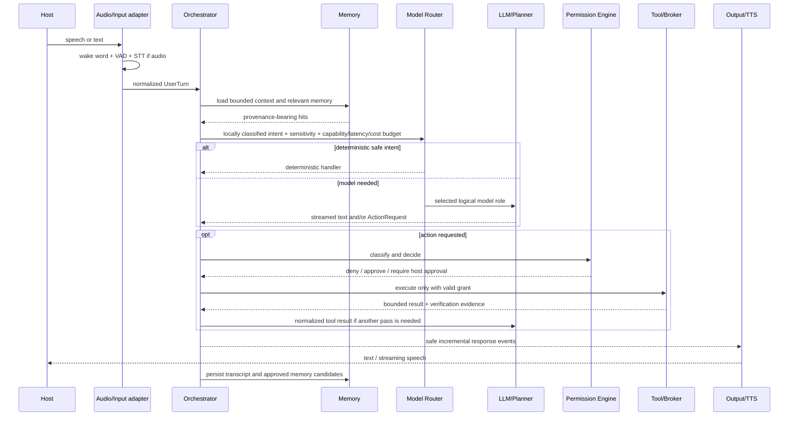
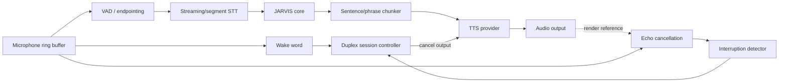
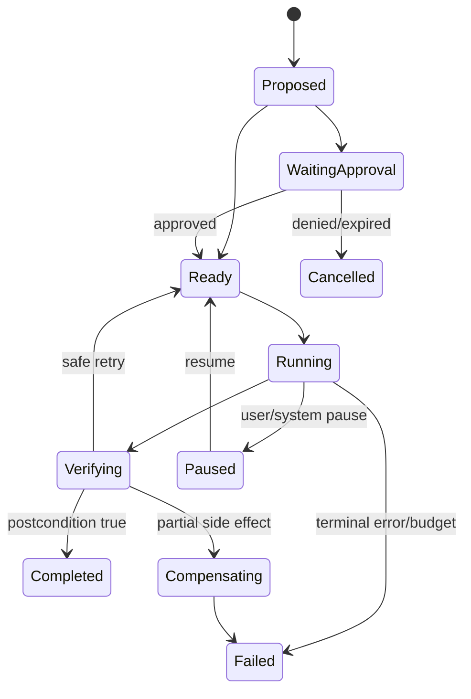
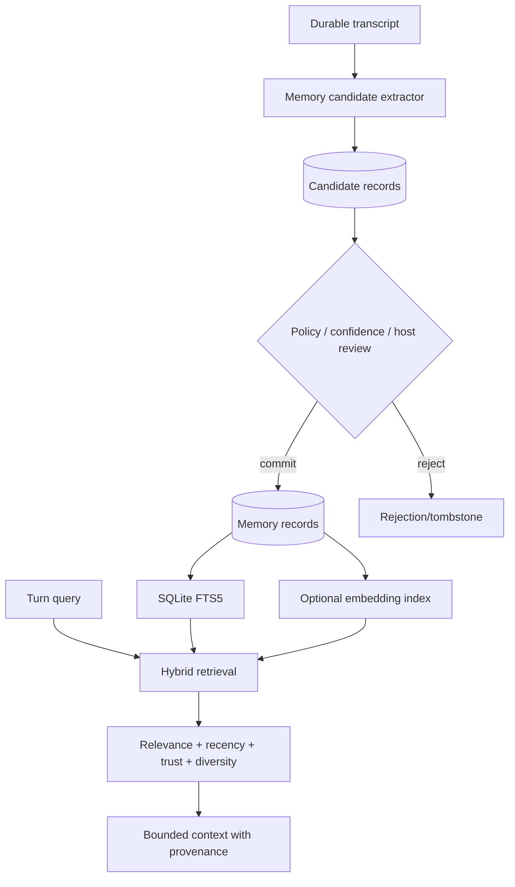
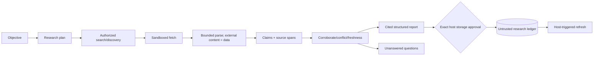
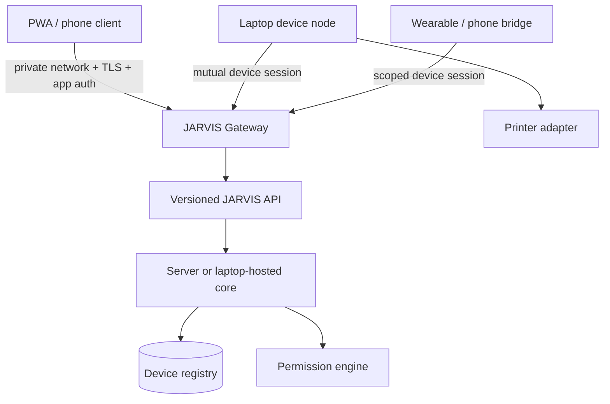
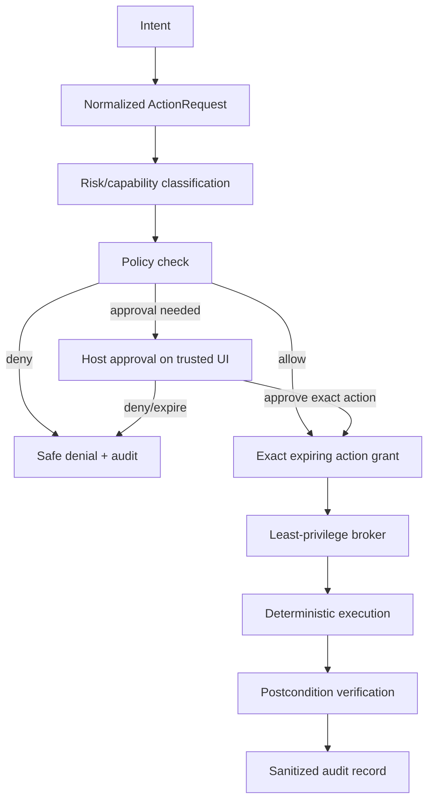

# JARVIS Architecture

Status: target architecture; implementation remains incremental  
Planning date: 2026-09-08
Last reconciled with Phase 1-8A implementation: 2026-09-10

Phases 4-7 and Phase 8A currently satisfy their completion gates. Phase 1 clean-host/bootstrap/repository
and prior optimized-local evidence pass, while hosted NVIDIA fixed latency remains an external
blocker despite preserved complete 20-sample states. Fresh 2026-09-08 local-cold revalidation also
missed its p50 target. Phase 2 and Phase 3 await separately authorized current live
device/effect checks. See `docs/PHASE_OVERVIEW.md`; these status limits do not alter the
architecture boundaries below.

## 1. Architectural style

JARVIS begins as a **modular monolith with ports and adapters**. One composition root wires independent interfaces for models, storage, tools, policy, research, audio, vision, and devices. This keeps local setup simple and tests deterministic. Process boundaries are added for two reasons only:

1. isolation of privileged/untrusted work; or
2. measured resource/concurrency needs such as blocking inference.

Core modules must not import Ollama, FastAPI, Windows automation, microphones, cameras, or a specific database driver. Adapters translate those systems to owned contracts.

## 2. Logical module map

```text
src/jarvis/
  core/              owned messages, events, orchestration, cancellation
  models/            provider contracts, capability registry, routing
  personality/       prompts and response policies
  tools/             typed definitions, registry, execution results
  permissions/       risk classification, approval, policy decisions
  audit/             append-only action records and redaction
  memory/            transcripts, profile, episodes, tasks, retrieval
  research/          source acquisition, claims, notes, citations
  planning/          durable task graphs and bounded execution
  voice/             VAD, wake word, STT, TTS, duplex controller
  vision/            capture, fast CV, OCR, multimodal escalation
  gestures/          temporal recognition and configurable mappings
  devices/           identity, capabilities, status, sessions
  communications/    draft/send-separated adapters
  api/               versioned HTTP/event-stream adapter
  observability/     metrics, traces, health, cost and resource events
  adapters/          Ollama, SQLite, Windows, browser, providers
```

Do not create empty directories for future modules. Add a module when it ships a contract, working adapter, and tests.

## 3. Major components

| Component | Owns | Must not own |
| --- | --- | --- |
| Interaction API | Validation, authentication context, streaming transport | Model or tool business logic |
| Conversation orchestrator | One bounded turn, event emission, cancellation | Provider wire formats, OS privileges |
| Intent/model router | Deterministic bypass, logical model role selection, fallback | Action authorization |
| Model providers | Provider-specific requests/responses and capabilities | Core memory or permissions |
| Personality policy | Voice, style, answer-length and behavioral guidance | Security decisions |
| Memory manager | Candidate extraction, commit, retrieval, correction, deletion | Treating all transcript text as truth |
| Tool registry | Explicit tool definitions and schema validation | Dynamic arbitrary code loading |
| Permission engine | Risk classification and policy decision | OS elevation or execution |
| Privilege broker | Narrow authorized action execution | Conversational reasoning |
| Planner | Bounded task DAG and checkpoints | Bypassing tool policy |
| Research engine | Sources, claims, conflicts, citations, freshness | Treating page instructions as trusted |
| Device registry | Device identity, capabilities, permissions, health | Shared static credentials |
| Audit/observability | Sanitized events, metrics, evidence | Raw secrets or hidden model reasoning |

## 4. Owned contracts

The following conceptual interfaces form the replaceable seams:

```python
class ModelProvider(Protocol):
    capabilities: ModelCapabilities

    async def generate(self, request: ModelRequest) -> AsyncIterator[ModelEvent]: ...


class ModelRole(StrEnum):
    FAST = "fast"
    PRIMARY = "primary"
    REASONING = "reasoning"
    LOCAL = "local"


class ModelProfile(BaseModel):
    provider: str
    model_id: str
    capabilities: ModelCapabilities
    lifecycle: str
    max_context_tokens: int
    max_output_tokens: int


class RoutingDecision(BaseModel):
    role: ModelRole
    reason: str
    sensitivity: str
    reasoning_level: str
    fallback_roles: tuple[ModelRole, ...]


class ProviderUsage(BaseModel):
    input_tokens: int | None
    output_tokens: int | None
    latency_ms: int
    rate_limit: dict[str, int | str]
    estimated_cost_usd: Decimal


class MemoryStore(Protocol):
    async def append_message(self, message: Message) -> None: ...
    async def search(self, query: MemoryQuery) -> list[MemoryHit]: ...
    async def delete(self, selector: MemorySelector) -> DeletionReceipt: ...


class Tool(Protocol):
    definition: ToolDefinition

    async def execute(self, args: BaseModel, context: ExecutionContext) -> ToolResult: ...


class PermissionEngine(Protocol):
    async def decide(self, request: ActionRequest, actor: Actor) -> PolicyDecision: ...


class PrivilegeBroker(Protocol):
    async def execute(self, grant: ActionGrant) -> ExecutionReceipt: ...
```

Provider capability flags include streaming, tool calls, parallel tool calls, JSON schema, vision, embeddings, audio, reasoning modes, maximum accepted context, and privacy class. Capability negotiation and startup catalog validation fail explicitly; the core does not guess. Provider/model IDs live in configuration and `ModelProfile`, never routing branches.

## 5. Complete interaction pipeline



Latency rules:

- run wake word and VAD continuously on CPU; do not invoke an LLM for silence;
- start STT from buffered pre-roll and emit partial transcripts;
- classify sensitivity locally before any cloud request;
- summarize older turns locally, retrieve only relevant memory, and disclose neither until the
  complete candidate context is classified public;
- send only query-relevant public tool schemas to cloud providers;
- stream model events immediately, but buffer enough text for stable TTS phrasing;
- bypass LLM for deterministic commands with validated unambiguous intent;
- load only a bounded context and retrieval set;
- cancel provider, planner, tool, and TTS work through one turn cancellation token.

## 6. Voice architecture and barge-in



Phase 2 implements the push-to-talk slice and keeps both always-listening modes hard-disabled even
after detector evaluation. Enabling a resident listener remains a later product/privacy decision
requiring a persistent indicator and separately verified physical mute workflow.

Implemented Phase 2 choices:

- Silero VAD on CPU for speech activity and endpointing;
- faster-whisper `base.en` with CPU/int8 execution to avoid 4 GB GPU contention;
- openWakeWord ONNX and a deterministic double-clap detector as disabled-by-default foundations;
- Windows SAPI for local TTS; Piper is not bundled because the current maintained package is GPL;
- no cloud STT/TTS or realtime-audio adapter.

Barge-in is a session-state transition, not another model prompt. New host speech cancels queued TTS and current audio output, preserves already-audible text metadata, marks the previous turn interrupted, and begins a fresh input segment. Echo cancellation or render-reference suppression must prevent JARVIS from interrupting itself.

Provider racing, if added later, is backend-only. The first provider to emit visible content owns
the turn; no second provider can replace or append a competing spoken answer. Current voice invokes
one core turn and TTS once, with no generic filler. A future acknowledgement is permitted only for
a genuinely long cloud task after the configured normal-voice speech-start budget is exceeded.

### Phase 7A vision capture boundary

Phase 7A adds a provider-neutral capture controller, not a recognition pipeline. An exact request
binds camera or screen source ID, purpose, region, RGB24 format, FPS, frame count, duration,
per-frame timeout, and ephemeral retention. Both the process-start host gate and persistent local
software control must be enabled; capture still begins only from an explicit foreground command.


OpenCV camera and Pillow screen adapters run in short-lived child processes over private pipes.
Workers inherit no JARVIS/provider credentials and write no media. Indicator activation precedes
source open; source close precedes indicator clear. Kill, cancellation, stale/malformed frames,
source loss, timeout, settings uncertainty, or consumer failure stops the session and clears owned
buffers. Only one session is allowed. No listener starts at boot.

Gesture/landmark recognition, calibration, mappings, OCR, biometrics, cloud vision, retention, and
Phase 3 action proposals remain outside 7A. Capture produces no authority.

### Phase 7B local gesture core

Phase 7B consumes one controller-owned ephemeral frame through a provider-neutral landmark detector
port. A strict landmark frame contains zero, one, or two hands; each hand has exactly 21 normalized
local landmarks, handedness, and confidence. Per-frame landmarks are never persisted or logged.
Only aggregate dimensionless calibration thresholds may survive as a profile; current code does not
expose profile persistence or a live calibration UI.

The deterministic temporal recognizer requires one fresh, ordered, confident hand. It classifies
fist, palm, and pinch only after consecutive-frame debounce. Finger roll requires bounded angular
motion, stable radius, and directional consistency. Cooldown plus observed release prevents held
pose storms. No-hand, multiple hands, conflicts, low confidence, stale/replayed/out-of-order frames,
drops, malformed geometry, and unknown poses emit nothing. Restart/reset clears all temporal state.

Its output is a content-free typed gesture observation containing no action, arguments, permission,
approval, or tool fields. Phase 7C maps that observation to a closed typed intent; Phase 3
alone may propose and execute an allowed action.

The concrete detector runs the pinned OpenCV Zoo palm and hand-pose ONNX models through local
OpenCV DNN. Explicit setup verifies SHA-256 before install outside Git; detection never downloads or
contacts a service. Its isolated camera worker receives explicit parent import roots under Python
isolated mode but no JARVIS/provider environment values. MediaPipe Tasks is not used.

### Phase 7C gesture-to-intent boundary

Phase 7C adds one foreground adapter from a revalidated content-free `GestureObservation` to the
existing Phase 3 hands-free gate. Its immutable mapping is fist to session cancel, palm to media
play/pause, pinch to the fixed Windows volume-mute key, and clockwise/counter-clockwise finger roll
to one clamped 5% volume step. Mapping configuration persists only as default-false action-family
flags in the host-owned computer policy.

The adapter derives a replay nonce from content-free event/session metadata. Phase 3 then rechecks
actor, active source session, policy epoch, freshness, confidence, replay, rate, and fixed Level 1
scope. It records the sanitized decision before calling a proposal callback. The only production
consumer calls `ActionCoordinator.propose`; trusted review, exact one-use grant issuance, broker
execution, and postcondition handling remain separate. Fist cancel permanently closes only its
bound gate session and creates no proposal or grant. No capture, thread, listener, background task,
approval, or execution starts from constructing the bridge.

## 7. Model routing

Routing begins with a deterministic local privacy and command gate. A cloud model never receives an unclassified turn. Uncertainty is treated as sensitive and stays local.

Routing input:

- intent class and deterministic-handler confidence;
- requested capabilities (tools, vision, structured output);
- complexity estimate and prior failed attempt;
- locally assigned sensitivity/privacy label;
- latency, energy, and cost budget;
- provider health, rate limit, context size, and device resources.

Routing output is a logical role and policy, not just a model name:

```json
{
  "role": "primary",
  "provider": "groq",
  "model_id": "qwen/qwen3.6-27b",
  "sensitivity": "non_sensitive",
  "reasoning_level": "none",
  "max_context_tokens": 131072,
  "max_output_tokens": 1024,
  "deadline_ms": 5000,
  "fallback_roles": ["fast", "local"],
  "cloud_allowed": true,
  "max_cloud_cost_usd": 0
}
```

Implemented latency tiers and role mapping:

| Tier / role | Default mapping | Policy |
| --- | --- | --- |
| Tier 0 | Deterministic typed tools/direct results | No model; cached results only when owning tool defines safe freshness |
| Tier 1 / `LOCAL` | Ollama `qwen3:0.6b` | Simple/normal, latency-sensitive, private/unknown, offline, and fallback work |
| Tier 2 / `FAST`, `PRIMARY` | Groq `openai/gpt-oss-20b`, `qwen/qwen3.6-27b` | Public work exceeding local capability but needing responsive interaction |
| Tier 3 / `REASONING` | NVIDIA `nvidia/nemotron-3.5-lightning-30b-a3b` | Difficult public reasoning/long work where latency is acceptable |

Routing order:

1. Run the local sensitivity and deterministic-command gate.
2. Execute recognized deterministic intents through typed tool/policy paths without an LLM when possible.
3. Route sensitive or uncertain content to `LOCAL`.
4. Route safe simple and normal work to `LOCAL`; explicit latency-sensitive cloud work uses `FAST`.
5. Route public moderate work exceeding local capability to responsive `PRIMARY`.
6. Route safe complex or large work to `REASONING` only when deep-task latency is acceptable.

Fallback respects both capabilities and privacy. A cloud provider receives one attempt; JARVIS does
not aggressively retry congestion. Rolling TTFT p50/p95, completion p50/p95, error rate, recent
`429`/`5xx`, quota state, and a temporary degradation window influence automatic ordering.
Severely degraded NVIDIA is deprioritized for automatic deep work but remains explicitly selectable
for deliberate long reasoning and direct benchmark evidence. Sensitive work never falls through to
cloud. Fallback ends when visible content begins, preserving one response owner.

NVIDIA uses a process-lifetime pooled `httpx.AsyncClient` with explicit connection/keep-alive
limits. Telemetry measures DNS, TCP, TLS, request upload, response headers, first SSE frame, first
reasoning token, first visible token, final visible token, and completion. It also records token,
message, public-schema, reasoning-budget, failure, and rate-limit counts without prompt/response
content. Routing around NVIDIA never changes or replaces NVIDIA-specific benchmark results.

Initial cloud credentials belong to free/trial service and the cloud budget is exactly `$0`. All cloud transfer remains external disclosure. NVIDIA trial service is prohibited for sensitive, personal, confidential, credential, file, memory, communication, or device content.

The router never authorizes actions. Every role faces the same deterministic permission checks. User overrides may select a stricter local route or a configured model within policy, but cannot bypass sensitivity, capability, or zero-spend rules.

## 8. Tool and planning architecture

### Tool definition

Every tool declares:

- stable name/version and narrow description;
- Pydantic argument/result schemas;
- risk level and side-effect class;
- required host/device capabilities;
- timeout, output-size limit, and concurrency rule;
- idempotency behavior and postcondition verifier;
- approval rule and rollback/compensation where practical.

Model output becomes an `ActionRequest`, never an executable command. Arguments are schema-validated,
canonicalized, policy-checked, approved where needed, and converted to an expiring one-use grant
with an opaque nonce and exact canonical fingerprint. The broker rejects parameter changes,
replays, stale grants, authentication/capability downgrade, wrong actor/session/device/interface,
and changed policy.

Phase 3 implements this slice for non-elevated Windows actions. Two host gates expose an immutable
registry. Model-facing side-effect tools are inert and can persist proposals only; authenticated
local CLI approval and execution are separate commands. SQLite transactions persist request,
decision, grant claim, receipt, broker events, and a content-free lifecycle projection. The broker
rechecks the complete policy fingerprint before effect dispatch. See
[Controlled Computer Access](CONTROLLED_COMPUTER_ACCESS.md).

### Planning engine



A task graph stores dependencies, attempts, deadlines, budgets, evidence, and approval references. Only nodes whose dependencies are complete may run. Retries require a classified transient error and idempotent or explicitly compensatable action. Restarts reload state; they do not blindly repeat `running` side effects.

Phase 6 implements this engine in `jarvis.planning`. An untrusted `TaskPlanProposal` contains only
objective, owner, provenance, requested budgets/deadline, dependencies, handler names/arguments,
timeouts, retry counts, and idempotency keys. `TaskPlanValidator` resolves node kind, retry mode,
resource charge, timeout ceiling, and approval requirement from the immutable runtime registry. It
rejects cycles, unknown dependencies/handlers, host-envelope expansion, unsafe effects/retries, and
planner-supplied authority before persistence.

Migration 008 adds host-scoped task records, append-only sanitized events, content-minimized effect
checkpoints, exact approval bindings, and content-free deletion tombstones. `SQLiteTaskStore` uses
optimistic versions and serialized transactions. `TaskScheduler` reserves charge before execution,
runs no more than four independent read-only nodes concurrently, serializes all effects, and has no
background worker. Every start is an explicit foreground call behind a default-false configuration
gate. Pause, resume, cancel, failure propagation, classified retry, compensation, and terminal
replay are durable.

Effect nodes checkpoint before dispatch and after verification. An orphaned read-only node may
return to ready only inside remaining retry/budget limits. An orphaned running/verifying/
compensating effect enters `needs_reconciliation`; handler-specific durable evidence must resolve it
before completion, and missing evidence never triggers blind replay. `computer.grant.execute`
delegates authority to the existing Phase 3 broker and accepts only an exact pre-existing one-use
grant. `research.report.inspect` exposes bounded metadata from an already approved host-scoped
Phase 5 report and does not treat report text as instruction. See [Bounded Tasks](BOUNDED_TASKS.md).

Specialized agents are bounded contexts:

- Conversation orchestrator: owns the current host interaction.
- Research agent: receives read/network-only tools and a source-quality contract.
- Computer agent: receives only approved device capabilities and action grants.
- Vision agent: receives bounded images/artifact references, no automatic action rights.
- Communication agent: can draft by default; sending is a separate approval-gated tool.

## 9. Memory architecture

Memory types are separate records with separate retention and retrieval policies.

| Type | Examples | Default behavior |
| --- | --- | --- |
| Working | Current bounded turn/context | Restart-durable with one-day default expiry |
| Episodic | “Changed printer default on Aug 10” | Durable only when useful; event provenance |
| Profile | Name, preferences, devices | Explicit or high-confidence confirmation; inspectable |
| Semantic | Source-backed learned facts/notes | Requires source/provenance and freshness |
| Task | Pending plan, status, deadline | Durable operational state; explicit lifecycle |



SQLite initially stores canonical records and FTS5 indexes. Embeddings are introduced only with a golden retrieval set; at small scale they may be stored in SQLite and scored in-process. Adopt a vector extension only after packaging and backup behavior are verified. PostgreSQL/pgvector becomes an option when server concurrency or data volume exceeds SQLite, not before.

Phase 4 implements the SQLite/FTS5 path. Candidate, committed, corrected, expired, rejected, and
deleted/tombstone lifecycle states are distinct. Deterministic extraction from user messages writes
untrusted candidates only. Promotion binds the local host scope, trusted interface, candidate ID,
exact version, and content SHA-256. Explicit local remember is a separate host action.

Retrieval considers committed records only and combines FTS relevance, recency, confidence, and
provenance trust. Results carry a human-readable reason and warning flags for conflicts or
untrusted sources. Prompt projection is capped by record and character count; private or unknown
projected sensitivity forces local model routing before any provider request.

Each durable memory includes host ID, type, content, structured fields, provenance, confidence, created/updated/accessed timestamps, retention class, sensitivity label, version, and correction lineage. Semantic claims also include publication/retrieval dates and source content hash.

Deletion is transitive: canonical record, FTS row, embedding, summaries derived solely from it, cached prompt fragments, and associated raw media where policy permits. Audit retains only a minimal deletion receipt, not deleted content.

The Phase 4 derivation graph deletes a derived record when its last source is deleted. Canonical
content, FTS entries, provenance, and conflicts are physically removed. Tombstones and deletion
events retain identifiers/counts and timestamps only, never deleted content or its hash. JSON
export uses exclusive local-file creation; SQLite backup/restore uses the consistent backup API and
integrity verification.

## 10. Research and learning engine



Source artifacts and model-generated summaries remain distinct. A claim never cites another generated summary as if it were the primary source. Labels include verified, likely, hypothesis, opinion, stale, and conflicting. “Verified” means supported under configured evidence rules; it does not mean universally true.

Webpages, PDFs, documents, tool outputs, and retrieved notes are untrusted data. Their embedded instructions cannot add tools, change system prompts, alter permissions, or authorize network/file actions. Fetch and parsing use size, type, domain, redirect, timeout, and download limits.

Phase 5 migrations 006–007 and `SQLiteResearchStore` implement the durable ledger independently
from trusted memory. `BoundedResearchOrchestrator` composes provider-neutral discovery, pinned HTTP
fetching, isolated parsing, synthesis, and citation review under total query/source/fetch/domain/
byte/time budgets. The production parser runs HTML, plain text, and PDF extraction in a short-lived
`python -I` subprocess with a minimal environment, temporary working directory, input/output caps,
PDF page/filter limits, and no action tools. This reduces parser blast radius but is not a Windows
AppContainer or kernel security boundary.

Source versions retain URL, publisher, title, topic, media type, SHA-256, access/publication dates,
validators, bounded extracted text, usage notes, state, and lineage. Claims retain typed evidence
links, uncertainty, status, version, and replacement lineage. The citation validator requires exact
source spans, caps quoted words, rejects fabricated/unknown evidence, and renders nearby source IDs
itself. Malformed configured-model synthesis degrades to deterministic extractive claims rather
than weakening validation. Changed/unavailable sources stale dependent claims; claim replacement
dismisses obsolete open conflicts. Host scope applies to every read, search, citation, conflict,
mutation, export, and deletion path. Active sources alone enter FTS5. Transitive deletion removes
all URL versions and dependent reports/claims/citations/conflicts/index rows; tombstones and
append-only events retain no source text, claim text, quote, or content hash. Research remains
untrusted and is never silently promoted into Phase 4 memory.

## 11. Device and network architecture



The same API exists in laptop-hosted and dedicated-server deployment. Laptop-specific automation is a device-node capability; core orchestration addresses `device_id + capability`, never an assumed local desktop.

Device record:

- immutable ID and display name;
- device type and owner/host ID;
- public key/credential reference;
- declared and attested capabilities;
- scoped permissions and risk ceiling;
- enrollment, last-seen, credential expiry, status, and revocation state.

Phase 8A implements this registry in additive SQLite migration 009 and adds an owned `/api/v1`
identity surface. A trusted local command creates a five-minute, single-use enrollment record with
fixed scopes and risk ceiling. The client proves possession of a unique Ed25519 private key; only
its public key/fingerprint is stored. A directly signed request issues a 15-minute opaque session,
with only the token digest retained. Protected requests require both that token and a device
signature over method, authority, raw path/query, body digest, UTC date, nonce, audience, device,
key version, and token digest. Atomic durable nonce consumption prevents concurrent and restarted
replay. Rotation proves current and new key possession, increments key version, and revokes old
sessions; trusted-local device revocation revokes all sessions immediately.

The implemented v1 surface is intentionally identity-only: enrollment completion, session issue,
current identity, current-device audit events, current-session logout, and key rotation. It adds no
chat/task/action capability. Denial/lifecycle audit is sanitized and device-scoped. See
`docs/REMOTE_ACCESS.md` and ADR 0002.

Remote access defaults to Tailscale/private networking with deny-by-default grants, plus JARVIS application authentication. Private networking is not sufficient authorization. Use TLS, per-device credentials, session expiry, replay protection, rate limits, and revocation. Do not expose Ollama, the privilege broker, or an unauthenticated JARVIS port to the public Internet.

## 12. Security boundaries



Trust boundaries:

1. Host/client boundary: authenticate actor and device; voice identity alone is insufficient.
2. Model boundary: all output is untrusted proposal data.
3. Retrieved-content boundary: web/files/documents never supply authority.
4. Tool boundary: exact schemas, capabilities, permissions, budgets.
5. Action boundary: Phase 3 fixed in-process broker is non-elevated and unreachable through direct
   model invocation; a separately authenticated service is required before any Level 4 capability.
6. Network boundary: loopback by default, explicit authenticated remote gateway.
7. Provider boundary: redact/minimize outbound data; privacy label controls cloud use.
8. Persistence boundary: encryption/OS access, retention, backup, deletion.
9. Media-capture boundary: exact foreground request, dual gates, visible indicator, isolated
   worker, ephemeral buffer clearing, and no action authority.

Detailed controls are in `SECURITY_MODEL.md`.

## 13. Audit and observability

The general design envelope for important actions contains:

- event and correlation IDs; UTC timestamp;
- actor/host/device/session and originating request ID;
- interpreted intent and plan node;
- tool name/version and sanitized parameters;
- risk/permission level, policy rule, approval reference;
- start/end/duration, result status, normalized error;
- verifier evidence reference and model/provider role where relevant.

Never log credentials, authorization headers, raw environment, private keys, full sensitive file content, hidden reasoning, or unrestricted audio/video. Hash or tokenize sensitive identifiers where operationally sufficient.

Phase 3 operator views are intentionally narrower: event time/type, action/version, permission
level, source, risk, outcome/reason code, and correlation IDs. They omit parameters, private
content, actors/devices, fingerprints, and raw results. Exact authority remains private enforcement
state, not a display log.

Metrics:

- wake/VAD/STT/TTS and time-to-first-audio latency;
- model time to first token, tokens/second, context/output size;
- router decision and fallback count;
- tool queue/execution/verification time and error rate;
- memory retrieval latency, hit acceptance, correction/deletion rates;
- CPU, RAM, GPU, VRAM, temperature/power where available;
- provider availability, rate limits, token/API cost;
- active sessions, tasks, devices, and permission denials.

Use structured logs and OpenTelemetry-compatible concepts, but avoid an observability backend until local files/console plus test assertions become insufficient.

## 14. Failure handling

| Failure | Required behavior |
| --- | --- |
| Local model unavailable | Health mark, bounded retry only for transient start, fallback if privacy/policy allows |
| Cloud unavailable/rate-limited | Preserve local function, honor retry-after, never loop indefinitely |
| Tool timeout | Cancel, mark uncertain if side effect may have occurred, verify before retry |
| Internet loss | Keep local chat/tools/memory; pause remote research/tasks with durable state |
| STT failure | Ask for repeat or offer text; do not fabricate transcript |
| TTS failure | Continue text output; reset audio state |
| Device disconnect | Mark capability unavailable; do not crash core or redirect action silently |
| Database failure | Roll back transaction, protect prior data, enter degraded/read-only state where safe |
| Permission service failure | Fail closed for actions; conversation may continue |
| Process restart | Recover persisted tasks as `needs_reconciliation`, never blindly replay side effects |

## 15. Testing architecture

- Unit: router, policy, schemas, retrieval scoring, redaction, state transitions, deterministic tools.
- Contract: every model, STT/TTS, research, browser, device, and storage adapter against
  recorded/mocked protocol cases.
- Integration: model event → action request → policy → fake broker → verification → audit.
- Agent/planning: golden task graphs, dependency and budget correctness, restart reconciliation.
- Security: injection, SSRF/rebinding, hostile documents, traversal, argument confusion, replay,
  stale approval, cross-host/device isolation, auth/rate limits.
- Voice: fixed audio corpus, WER, endpoint latency, false wake/reject, echo and barge-in.
- Vision capture: dual-gate denial, indicator/open ordering, source loss, stale/malformed frames,
  limits, cancellation/kill, restart state, zeroed buffers, and camera-independent fakes.
- Memory/research: golden retrieval, citations, provenance, contradiction, freshness, correction,
  retention, and transitive deletion.
- Failure: provider outage, partial tool effects, corrupt response, full disk, database lock, device/network loss.
- Performance: reproducible warm/cold benchmarks with resource telemetry and p50/p95 reports.

Live model/hardware tests are explicit and separate from normal CI. Ordinary CI must pass without microphone, camera, GPU, network, or downloaded weights.

## 16. Technology sources checked

Current candidate facts were checked on 2026-08-19 against primary project/vendor pages:

- [Ollama Qwen 3.5 4B](https://ollama.com/library/qwen3.5%3A4b)
- [Ollama Qwen 3 tags](https://ollama.com/library/qwen3/tags)
- [faster-whisper](https://github.com/SYSTRAN/faster-whisper)
- [Silero VAD](https://github.com/snakers4/silero-vad)
- [openWakeWord](https://github.com/dscripka/openWakeWord)
- [Piper](https://github.com/OHF-Voice/piper1-gpl)
- [MediaPipe Hand Landmarker](https://ai.google.dev/edge/api/mediapipe/python/mp/tasks/vision/HandLandmarker)
- [Tailscale device visibility and default-deny access](https://tailscale.com/docs/concepts/device-visibility)
- [OpenAI API model catalog](https://developers.openai.com/api/docs/models)
- [Meta AI wearables and Device Access Toolkit](https://about.fb.com/news/2026/05/meta-ai-wearables-changing-the-game-for-disabled-people/)

All third-party licenses, model licenses, data terms, platform availability, and API capabilities must be rechecked at adoption time.
