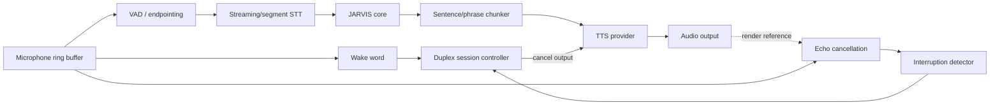
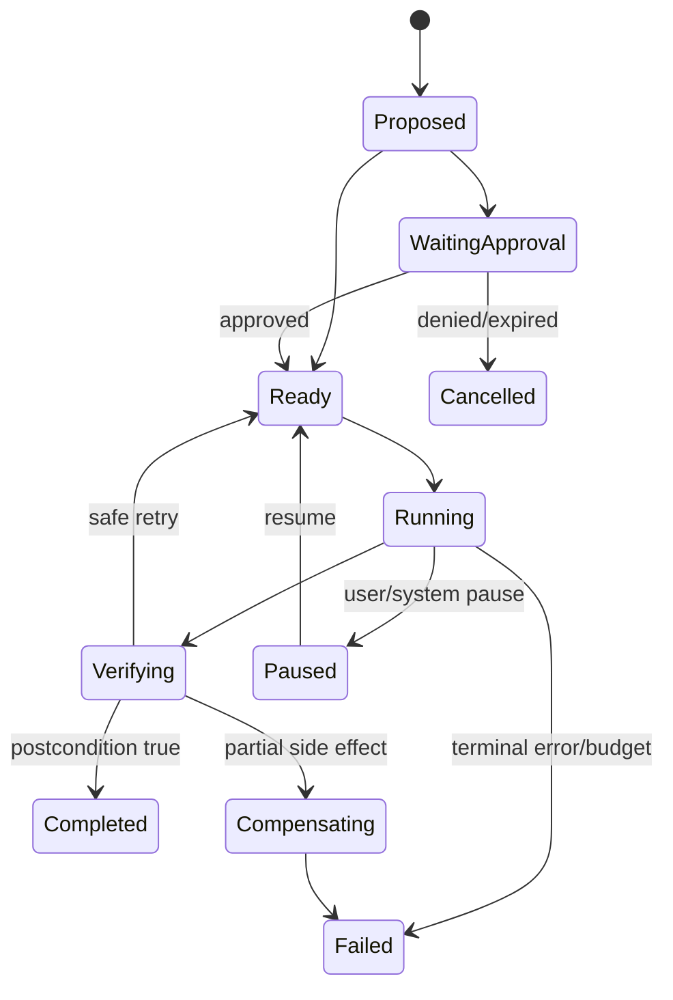
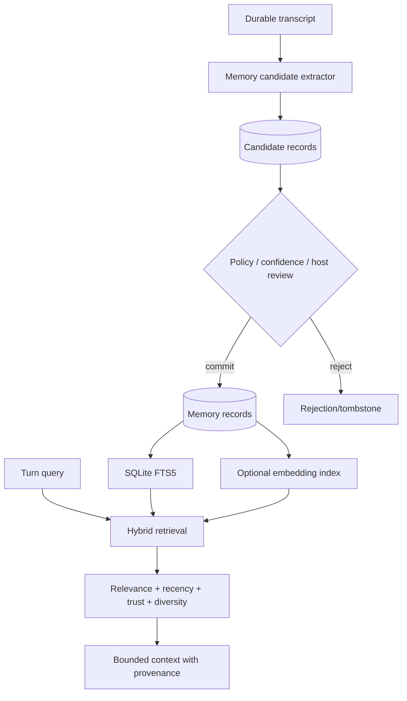
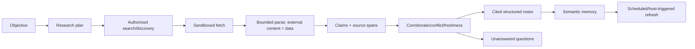
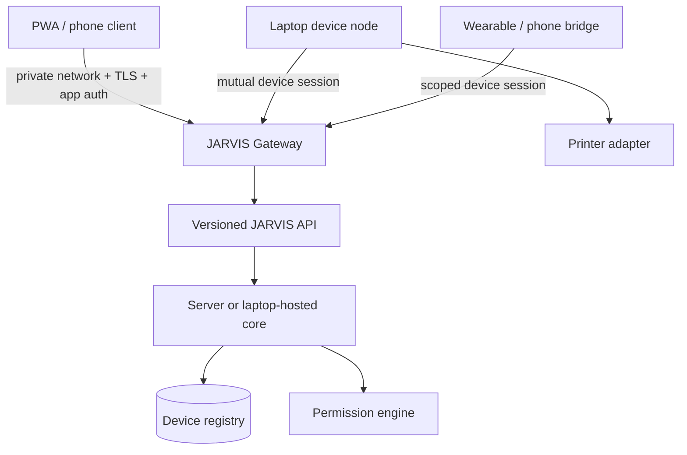
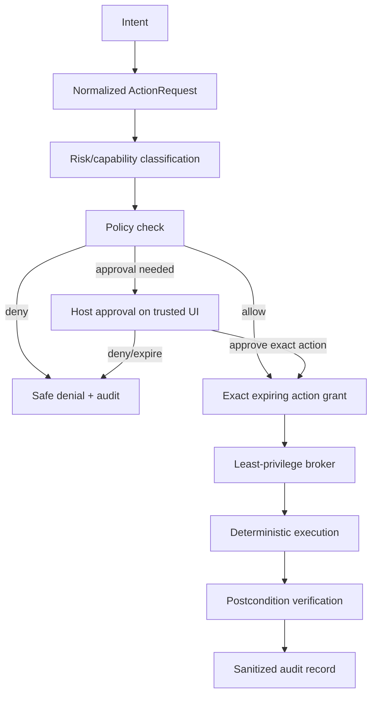

# JARVIS Architecture

Status: target architecture; implementation remains incremental  
Planning date: 2026-08-19

## 1. Architectural style

JARVIS begins as a **modular monolith with ports and adapters**. One composition root wires independent interfaces for models, storage, tools, policy, research, audio, vision, and devices. This keeps local setup simple and tests deterministic. Process boundaries are added for two reasons only:

1. isolation of privileged/untrusted work; or
2. measured resource/concurrency needs such as blocking inference.

Core modules must not import Ollama, FastAPI, Windows automation, microphones, cameras, or a specific database driver. Adapters translate those systems to owned contracts.

## 2. Logical module map

```text
src/jarvis/
  core/              owned messages, events, orchestration, cancellation
  models/            provider contracts, capability registry, routing
  personality/       prompts and response policies
  tools/             typed definitions, registry, execution results
  permissions/       risk classification, approval, policy decisions
  audit/             append-only action records and redaction
  memory/            transcripts, profile, episodes, tasks, retrieval
  research/          source acquisition, claims, notes, citations
  planning/          durable task graphs and bounded execution
  voice/             VAD, wake word, STT, TTS, duplex controller
  vision/            capture, fast CV, OCR, multimodal escalation
  gestures/          temporal recognition and configurable mappings
  devices/           identity, capabilities, status, sessions
  communications/    draft/send-separated adapters
  api/               versioned HTTP/event-stream adapter
  observability/     metrics, traces, health, cost and resource events
  adapters/          Ollama, SQLite, Windows, browser, providers
```

Do not create empty directories for future modules. Add a module when it ships a contract, working adapter, and tests.

## 3. Major components

| Component | Owns | Must not own |
| --- | --- | --- |
| Interaction API | Validation, authentication context, streaming transport | Model or tool business logic |
| Conversation orchestrator | One bounded turn, event emission, cancellation | Provider wire formats, OS privileges |
| Intent/model router | Deterministic bypass, logical model role selection, fallback | Action authorization |
| Model providers | Provider-specific requests/responses and capabilities | Core memory or permissions |
| Personality policy | Voice, style, answer-length and behavioral guidance | Security decisions |
| Memory manager | Candidate extraction, commit, retrieval, correction, deletion | Treating all transcript text as truth |
| Tool registry | Explicit tool definitions and schema validation | Dynamic arbitrary code loading |
| Permission engine | Risk classification and policy decision | OS elevation or execution |
| Privilege broker | Narrow authorized action execution | Conversational reasoning |
| Planner | Bounded task DAG and checkpoints | Bypassing tool policy |
| Research engine | Sources, claims, conflicts, citations, freshness | Treating page instructions as trusted |
| Device registry | Device identity, capabilities, permissions, health | Shared static credentials |
| Audit/observability | Sanitized events, metrics, evidence | Raw secrets or hidden model reasoning |

## 4. Owned contracts

The following conceptual interfaces form the replaceable seams:

```python
class ModelProvider(Protocol):
    capabilities: ModelCapabilities
    async def generate(self, request: ModelRequest) -> AsyncIterator[ModelEvent]: ...

class MemoryStore(Protocol):
    async def append_message(self, message: Message) -> None: ...
    async def search(self, query: MemoryQuery) -> list[MemoryHit]: ...
    async def delete(self, selector: MemorySelector) -> DeletionReceipt: ...

class Tool(Protocol):
    definition: ToolDefinition
    async def execute(self, args: BaseModel, context: ExecutionContext) -> ToolResult: ...

class PermissionEngine(Protocol):
    async def decide(self, request: ActionRequest, actor: Actor) -> PolicyDecision: ...

class PrivilegeBroker(Protocol):
    async def execute(self, grant: ActionGrant) -> ExecutionReceipt: ...
```

Provider capability flags include streaming, tool calls, JSON schema, vision, embeddings, audio, maximum accepted context, and privacy class. Capability negotiation fails explicitly; the core does not guess.

## 5. Complete interaction pipeline


Latency rules:

- run wake word and VAD continuously on CPU; do not invoke an LLM for silence;
- start STT from buffered pre-roll and emit partial transcripts;
- retrieve memory concurrently with lightweight intent classification where safe;
- stream model events immediately, but buffer enough text for stable TTS phrasing;
- bypass LLM for deterministic commands with validated unambiguous intent;
- load only a bounded context and retrieval set;
- cancel provider, planner, tool, and TTS work through one turn cancellation token.

## 6. Voice architecture and barge-in



First vertical slice is push-to-talk. Always-listening behavior follows privacy, false-wake, and soak testing.

Recommended first candidates:

- Silero VAD on CPU for speech activity and endpointing;
- faster-whisper with a small/int8 candidate, testing CPU execution to avoid 4 GB GPU contention;
- openWakeWord ONNX on Windows for the wake word;
- Piper on CPU for low-latency local TTS;
- cloud STT/TTS or realtime audio only behind explicit provider and privacy settings.

Barge-in is a session-state transition, not another model prompt. New host speech cancels queued TTS and current audio output, preserves already-audible text metadata, marks the previous turn interrupted, and begins a fresh input segment. Echo cancellation or render-reference suppression must prevent JARVIS from interrupting itself.

## 7. Model routing

Routing input:

- intent class and deterministic-handler confidence;
- requested capabilities (tools, vision, structured output);
- complexity estimate and prior failed attempt;
- sensitivity/privacy label;
- latency, energy, and cost budget;
- provider health, rate limit, context size, and device resources.

Routing output is a logical role and policy, not just a model name:

```json
{
  "role": "main",
  "provider": "local",
  "max_context_tokens": 8192,
  "max_output_tokens": 1024,
  "deadline_ms": 12000,
  "fallback_roles": ["heavy"],
  "cloud_allowed": false
}
```

The router never authorizes actions. A Tier 3 answer faces the same permission checks as Tier 1.

## 8. Tool and planning architecture

### Tool definition

Every tool declares:

- stable name/version and narrow description;
- Pydantic argument/result schemas;
- risk level and side-effect class;
- required host/device capabilities;
- timeout, output-size limit, and concurrency rule;
- idempotency behavior and postcondition verifier;
- approval rule and rollback/compensation where practical.

Model output becomes an `ActionRequest`, never an executable command. Arguments are schema-validated, canonicalized, policy-checked, approved where needed, and converted to an expiring signed/opaque grant bound to exact parameters. The broker rejects parameter changes, replays, stale grants, wrong actor, and wrong device.

### Planning engine



A task graph stores dependencies, attempts, deadlines, budgets, evidence, and approval references. Only nodes whose dependencies are complete may run. Retries require a classified transient error and idempotent or explicitly compensatable action. Restarts reload state; they do not blindly repeat `running` side effects.

Specialized agents are bounded contexts:

- Conversation orchestrator: owns the current host interaction.
- Research agent: receives read/network-only tools and a source-quality contract.
- Computer agent: receives only approved device capabilities and action grants.
- Vision agent: receives bounded images/artifact references, no automatic action rights.
- Communication agent: can draft by default; sending is a separate approval-gated tool.

## 9. Memory architecture

Memory types are separate records with separate retention and retrieval policies.

| Type | Examples | Default behavior |
| --- | --- | --- |
| Working | Current bounded turn/context | Ephemeral projection from recent messages |
| Episodic | “Changed printer default on Aug 10” | Durable only when useful; event provenance |
| Profile | Name, preferences, devices | Explicit or high-confidence confirmation; inspectable |
| Semantic | Source-backed learned facts/notes | Requires source/provenance and freshness |
| Task | Pending plan, status, deadline | Durable operational state; explicit lifecycle |



SQLite initially stores canonical records and FTS5 indexes. Embeddings are introduced only with a golden retrieval set; at small scale they may be stored in SQLite and scored in-process. Adopt a vector extension only after packaging and backup behavior are verified. PostgreSQL/pgvector becomes an option when server concurrency or data volume exceeds SQLite, not before.

Each durable memory includes host ID, type, content, structured fields, provenance, confidence, created/updated/accessed timestamps, retention class, sensitivity label, version, and correction lineage. Semantic claims also include publication/retrieval dates and source content hash.

Deletion is transitive: canonical record, FTS row, embedding, summaries derived solely from it, cached prompt fragments, and associated raw media where policy permits. Audit retains only a minimal deletion receipt, not deleted content.

## 10. Research and learning engine



Source artifacts and model-generated summaries remain distinct. A claim never cites another generated summary as if it were the primary source. Labels include verified, likely, hypothesis, opinion, stale, and conflicting. “Verified” means supported under configured evidence rules; it does not mean universally true.

Webpages, PDFs, documents, tool outputs, and retrieved notes are untrusted data. Their embedded instructions cannot add tools, change system prompts, alter permissions, or authorize network/file actions. Fetch and parsing use size, type, domain, redirect, timeout, and download limits.

## 11. Device and network architecture



The same API exists in laptop-hosted and dedicated-server deployment. Laptop-specific automation is a device-node capability; core orchestration addresses `device_id + capability`, never an assumed local desktop.

Device record:

- immutable ID and display name;
- device type and owner/host ID;
- public key/credential reference;
- declared and attested capabilities;
- scoped permissions and risk ceiling;
- enrollment, last-seen, credential expiry, status, and revocation state.

Remote access defaults to Tailscale/private networking with deny-by-default grants, plus JARVIS application authentication. Private networking is not sufficient authorization. Use TLS, per-device credentials, session expiry, replay protection, rate limits, and revocation. Do not expose Ollama, the privilege broker, or an unauthenticated JARVIS port to the public Internet.

## 12. Security boundaries



Trust boundaries:

1. Host/client boundary: authenticate actor and device; voice identity alone is insufficient.
2. Model boundary: all output is untrusted proposal data.
3. Retrieved-content boundary: web/files/documents never supply authority.
4. Tool boundary: exact schemas, capabilities, permissions, budgets.
5. Privilege boundary: separate broker; core is not always elevated.
6. Network boundary: loopback by default, explicit authenticated remote gateway.
7. Provider boundary: redact/minimize outbound data; privacy label controls cloud use.
8. Persistence boundary: encryption/OS access, retention, backup, deletion.

Detailed controls are in `SECURITY_MODEL.md`.

## 13. Audit and observability

Important actions emit an append-only logical record containing:

- event and correlation IDs; UTC timestamp;
- actor/host/device/session and originating request ID;
- interpreted intent and plan node;
- tool name/version and sanitized parameters;
- risk/permission level, policy rule, approval reference;
- start/end/duration, result status, normalized error;
- verifier evidence reference and model/provider role where relevant.

Never log credentials, authorization headers, raw environment, private keys, full sensitive file content, hidden reasoning, or unrestricted audio/video. Hash or tokenize sensitive identifiers where operationally sufficient.

Metrics:

- wake/VAD/STT/TTS and time-to-first-audio latency;
- model time to first token, tokens/second, context/output size;
- router decision and fallback count;
- tool queue/execution/verification time and error rate;
- memory retrieval latency, hit acceptance, correction/deletion rates;
- CPU, RAM, GPU, VRAM, temperature/power where available;
- provider availability, rate limits, token/API cost;
- active sessions, tasks, devices, and permission denials.

Use structured logs and OpenTelemetry-compatible concepts, but avoid an observability backend until local files/console plus test assertions become insufficient.

## 14. Failure handling

| Failure | Required behavior |
| --- | --- |
| Local model unavailable | Health mark, bounded retry only for transient start, fallback if privacy/policy allows |
| Cloud unavailable/rate-limited | Preserve local function, honor retry-after, never loop indefinitely |
| Tool timeout | Cancel, mark uncertain if side effect may have occurred, verify before retry |
| Internet loss | Keep local chat/tools/memory; pause remote research/tasks with durable state |
| STT failure | Ask for repeat or offer text; do not fabricate transcript |
| TTS failure | Continue text output; reset audio state |
| Device disconnect | Mark capability unavailable; do not crash core or redirect action silently |
| Database failure | Roll back transaction, protect prior data, enter degraded/read-only state where safe |
| Permission service failure | Fail closed for actions; conversation may continue |
| Process restart | Recover persisted tasks as `needs_reconciliation`, never blindly replay side effects |

## 15. Testing architecture

- Unit: router, policy, schemas, retrieval scoring, redaction, state transitions, deterministic tools.
- Contract: every model, STT/TTS, browser, device, and storage adapter against recorded/mocked protocol cases.
- Integration: model event → action request → policy → fake broker → verification → audit.
- Agent/planning: golden task graphs, dependency and budget correctness, restart reconciliation.
- Security: injection, traversal, argument confusion, replay, stale approval, cross-host/device isolation, auth/rate limits.
- Voice: fixed audio corpus, WER, endpoint latency, false wake/reject, echo and barge-in.
- Memory: golden retrieval, provenance, contradiction, correction, retention, transitive deletion.
- Failure: provider outage, partial tool effects, corrupt response, full disk, database lock, device/network loss.
- Performance: reproducible warm/cold benchmarks with resource telemetry and p50/p95 reports.

Live model/hardware tests are explicit and separate from normal CI. Ordinary CI must pass without microphone, camera, GPU, network, or downloaded weights.

## 16. Technology sources checked

Current candidate facts were checked on 2026-08-19 against primary project/vendor pages:

- [Ollama Qwen 3.5 4B](https://ollama.com/library/qwen3.5%3A4b)
- [Ollama Qwen 3 tags](https://ollama.com/library/qwen3/tags)
- [faster-whisper](https://github.com/SYSTRAN/faster-whisper)
- [Silero VAD](https://github.com/snakers4/silero-vad)
- [openWakeWord](https://github.com/dscripka/openWakeWord)
- [Piper](https://github.com/OHF-Voice/piper1-gpl)
- [MediaPipe Hand Landmarker](https://ai.google.dev/edge/api/mediapipe/python/mp/tasks/vision/HandLandmarker)
- [Tailscale device visibility and default-deny access](https://tailscale.com/docs/concepts/device-visibility)
- [OpenAI API model catalog](https://developers.openai.com/api/docs/models)
- [Meta AI wearables and Device Access Toolkit](https://about.fb.com/news/2026/05/meta-ai-wearables-changing-the-game-for-disabled-people/)

All third-party licenses, model licenses, data terms, platform availability, and API capabilities must be rechecked at adoption time.
