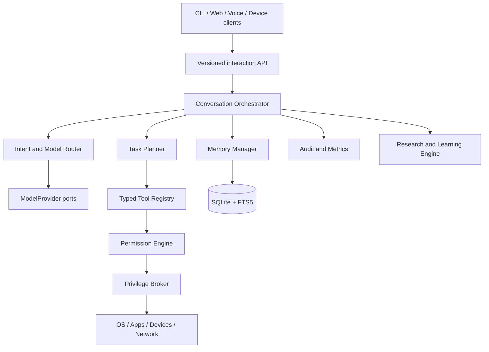
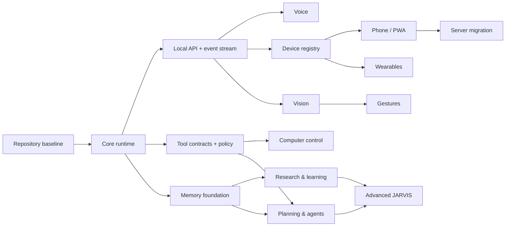

# JARVIS Master Roadmap

Status: decision-ready plan  
Planning date: 2026-09-08
Model catalog and free-tier facts last verified: 2026-08-20
Repository: `DanCreates1/JARVIS`, branch `main`

## 1. Vision and engineering principles

JARVIS is a privacy-aware hybrid personal AI operating layer: a composed conversational assistant that can use authorized tools, remember useful context, research with citations, and later work across voice, vision, laptop, phone, server, and wearable clients. Fast free-tier cloud inference is the default only for content a local deterministic gate classifies as non-sensitive. Sensitive work and offline fallback remain local.

Success is the product of **intelligence × latency × reliability × privacy × hardware efficiency**. The system will therefore be:

- useful before it is broad;
- a modular monolith before any service split;
- cloud-fast for non-sensitive work, local for sensitive or offline work, with no silent privacy downgrade;
- hard-capped at zero cloud spend during initial development;
- deterministic for actions that do not need a model;
- deny-by-default for tools and privileges;
- measurable, replaceable, and tested at every boundary.

Foundation-model training from zero is excluded. It would require a large curated dataset, multi-GPU training infrastructure, alignment and safety work, extensive evaluation, and ongoing serving capacity while offering no near-term advantage over current models. Fine-tuning is a later, evidence-driven option only after prompt, retrieval, memory, and tool-use evaluations expose a stable gap.

## 2. Discovered repository state

The repository no longer matches the legacy state assumed by the original planning request:

- `main` is clean at planning start and tracks `origin/main`.
- Current HEAD before this revision is `d08fdce` (`docs: add JARVIS architecture and development roadmap`).
- The old implementation is preserved at `archive/pre-jarvis-rebuild-2026-08-18`.
- The new repository already contains a Python 3.11 modular core, Ollama adapter, SQLite transcript store, typed tools, policy boundary, tests, CI, `.gitignore`, and `.env.example`.
- No tracked model-weight, private-key, certificate, `.env`, or obvious secret file was found. Packed Git objects total about 2.05 MiB.

Therefore Phase 0 is mostly complete. Its future procedure is idempotent: verify the archive and current tree first; never delete the current secure core merely to repeat a reset. See `PHASE_0_REBUILD_PLAN.md`.

## 3. Target architecture

The initial deployable is one Python application with ports and adapters. Heavy inference and privileged execution may run in worker processes, but they remain parts of one product deployment until scale or isolation data justifies extraction.



Detailed components, flows, network boundaries, and data ownership are defined in `JARVIS_ARCHITECTURE.md`.

## 4. Priorities

| Priority | Capabilities |
| --- | --- |
| P0 — Essential | Text conversation, personality, provider abstraction, model routing, durable transcripts, typed tools, permission enforcement, audit logging, failure handling, tests |
| P1 — Important | Voice, useful laptop tools, long-term memory controls, web research with citations, planning state, secure phone/PWA access |
| P2 — Advanced | Vision, gestures, dedicated server, communications, multi-device coordination, richer agents, proactive assistance |
| P3 — Experimental | Meta glasses, custom voice, user fine-tuning, advanced smart-home orchestration, continuous multimodal context |

## 5. Privacy-aware, zero-cost model strategy

The laptop has 16 GB RAM and an RTX 2050 with 4 GB VRAM. It can provide private/offline fallback but cannot match current hosted-model intelligence at interactive latency. Use free-tier cloud inference for locally classified non-sensitive work and Ollama for sensitive or offline work. Free tiers are quota-limited development capacity, not an availability guarantee or production SLA.

### Logical roles and verified defaults

| Role | Configured default | Verified status and capabilities | Intended use |
| --- | --- | --- | --- |
| `FAST` | Groq `openai/gpt-oss-20b` | Production; about 1,000 tokens/s; 131,072-token context; tools, reasoning, JSON object/schema modes; no parallel tool calls | Tier 2 responsive public cloud work |
| `PRIMARY` | Groq `qwen/qwen3.6-27b` | Preview; about 500 tokens/s; 131,072-token context; text/image input, tools, parallel tool calls, JSON mode, vision, thinking/non-thinking modes | Tier 2 moderate public work exceeding local capability |
| `REASONING` | NVIDIA `nvidia/nemotron-3.5-lightning-30b-a3b` | Hosted free endpoint; 1,000,000-token context; text, tools, and thinking | Tier 3 difficult public work where latency is acceptable |
| `LOCAL` | Ollama `qwen3:0.6b` | Installed 522,653,767-byte Q4_K_M model; tools and thinking; 4,096-token active context | Tier 1 simple/normal, latency-sensitive, sensitive/private, uncertain, and offline work |

The provider registry owns these roles. Model IDs occur in configuration and provider-catalog metadata, never in orchestration logic. NVIDIA, Groq, and Gemini remain replaceable adapters with startup catalog checks and tested fallback.

At verification, NVIDIA exposed model access but no fixed rate-limit headers. NVIDIA states trial limits are model/account-specific and visible in the API Catalog UI. JARVIS applies a conservative local 30-request/minute and one-concurrent-request guard; these guards are not claims about the account cap.

Target configuration contract:

```dotenv
JARVIS_FAST_PROVIDER=groq
JARVIS_FAST_MODEL=openai/gpt-oss-20b
JARVIS_PRIMARY_PROVIDER=groq
JARVIS_PRIMARY_MODEL=qwen/qwen3.6-27b
JARVIS_REASONING_PROVIDER=nvidia
JARVIS_REASONING_MODEL=nvidia/nemotron-3.5-lightning-30b-a3b
JARVIS_LOCAL_PROVIDER=ollama
JARVIS_LOCAL_MODEL=qwen3:0.6b
JARVIS_CLOUD_POLICY=privacy_aware
JARVIS_MAX_CLOUD_COST_USD=0
```

These variables are implemented Phase 1 configuration. Cloud roles remain inactive until
their key and mandatory free-tier/data-term confirmations are configured.

### Routing order

1. A deterministic local gate classifies sensitivity and obvious command intent before any cloud request.
2. A recognized deterministic command goes directly to its typed tool path; a model is not required merely to authorize or execute it.
3. Sensitive, personal, credential, file, memory, communication, and device context routes to `LOCAL`.
4. Safe simple/normal and latency-sensitive interaction routes to Tier 1 `LOCAL`.
5. Public work exceeding local capability but requiring responsiveness uses Tier 2 `FAST`/`PRIMARY`.
6. Safe difficult reasoning or long work where latency is acceptable uses Tier 3 `REASONING`.
7. Severe rolling NVIDIA tail latency temporarily deprioritizes automatic Tier 3 selection; explicit
   NVIDIA requests remain available and retain separate benchmark evidence.

The initial privacy gate is never a cloud model. A user may force a stricter local route but cannot force policy to disclose sensitive data. Model selection never authorizes an action: computer control, files, power, applications, and communications still require deterministic policy and any applicable trusted approval.

Fallback is capability- and privacy-aware:

- unavailable, retired, or quota-exhausted Qwen falls back to bounded GPT-OSS work and then local Ollama;
- unavailable, quota-exhausted, or severely degraded NVIDIA is attempted only once and falls back
  before visible output to responsive cloud/local capacity or a clear capacity error;
- sensitive work fails privately when local inference is unavailable and never silently crosses to cloud;
- HTTP `429`, provider outage, or catalog mismatch triggers fallback, not paid execution.

Use free/trial credentials only. The cost budget is a hard zero, not a warning, and all cloud transmission remains external disclosure. NVIDIA trial service must never receive sensitive, confidential, or personal information.

Verified sources: [NVIDIA Nemotron 3.5 Lightning](https://build.nvidia.com/nvidia/nemotron-3.5-lightning-30b-a3b), [NVIDIA Nemotron 3 Ultra](https://build.nvidia.com/nvidia/nemotron-3-ultra-550b-a55b/modelcard), [NVIDIA API reference](https://docs.api.nvidia.com/nim/reference/nvidia-nemotron-3-ultra-550b-a55b), [NVIDIA trial terms](https://assets.ngc.nvidia.com/products/api-catalog/legal/NVIDIA%20API%20Trial%20Terms%20of%20Service.pdf), plus the optional [Groq](https://console.groq.com/docs/models) and [Gemini](https://ai.google.dev/gemini-api/docs/models) catalogs.

Benchmark all roles on representative JARVIS tasks for time to first token, tokens/second, tool-call accuracy, reasoning quality, context behavior, provider failure rate, quota consumption, and privacy-policy accuracy. Local benchmarks additionally record RAM, VRAM, power, and temperature. Published speed and context figures are dated catalog observations, not acceptance results.

## 6. Performance targets

Targets are measured end-to-end at p50 and p95; they are not promises.

| Experience | Initial target |
| --- | --- |
| Wake-word decision after phrase | p50 ≤ 100 ms, p95 ≤ 200 ms |
| VAD end-of-speech decision | p50 ≤ 250 ms, p95 ≤ 450 ms |
| Short local transcription after speech ends | p50 ≤ 500 ms, p95 ≤ 1.2 s |
| Deterministic simple command, text result | p50 ≤ 300 ms, p95 ≤ 800 ms |
| First spoken response, deterministic command | p50 ≤ 800 ms, p95 ≤ 1.5 s |
| First useful output, normal non-sensitive cloud turn | p50 ≤ 1 s, p95 ≤ 2.5 s |
| First useful output, private local LLM turn | p50 ≤ 1.5 s, p95 ≤ 3 s |
| Complex cloud reasoning first useful output | p50 ≤ 3 s, p95 ≤ 7 s |
| Gesture frame-to-action decision | p50 ≤ 75 ms, p95 ≤ 150 ms |
| Tool success rate for supported happy paths | ≥ 99% before unattended safe actions |

The voice pipeline must stream partial events and begin TTS by sentence or safe phrase. Keep wake word and VAD resident on CPU. On this 4 GB GPU, benchmark CPU STT versus GPU model swapping; avoid simultaneous residency assumptions.

## 7. Dependency graph and parallel work



After core contracts stabilize, these tracks can proceed in parallel:

- voice adapters and latency harness;
- permission UI plus a first safe computer-tool set;
- memory schemas, retention, and retrieval evaluation;
- local API/control panel shell;
- security test fixtures and observability instrumentation.

Phone access waits for authenticated API and device enrollment. Research waits for source-aware memory. Long-running agents wait for durable task state, tool policy, approval gates, and bounded execution.

## 8. Staged roadmap

Relative size covers implementation and verification, not calendar time. Execution is divided into
resume-safe subphases, each limited to one five-hour Codex session:

| Phase | Ordered subphases | Recommended aggregate model/reasoning |
| --- | --- | --- |
| 0 | Continuous baseline audit | `gpt-5.6-sol` / `medium` |
| 1 | 1A contracts/config/persistence; 1B providers/routing/privacy; 1C tools/interfaces; 1D performance/closeout | `gpt-6-astra` / `xhigh` (`max` for 1D) |
| 2 | 2A push-to-talk/adapters; 2B duplex/wake safety; 2C device closeout | `gpt-6-astra` / `xhigh` |
| 3 | 3A permission broker; 3B actions/recovery; 3C adversarial/live closeout | `gpt-6-astra` / `ultra` |
| 4 | 4A schema/lifecycle/provenance; 4B retrieval/interfaces; 4C evaluation/deletion | `gpt-6-astra` / `xhigh` |
| 5 | 5A acquisition/parsing; 5B evidence/synthesis; 5C ledger/closeout | `gpt-6-astra` / `xhigh` |
| 6 | 6A DAG/validator/store; 6B scheduler/recovery; 6C interfaces/benchmark | `gpt-6-astra` / `ultra` |
| 7 | 7A capture/privacy/contracts; 7B gestures/calibration; 7C mapping/closeout | `gpt-6-astra` / `max` |
| 8 | 8A API/identity/enrollment; 8B approval/web hardening; 8C PWA/reconnect; 8D deployment/closeout | `gpt-6-astra` / `ultra` |
| 9 | 9A topology/protocol/identity; 9B migration/backup/reconciliation; 9C deployment/resilience | `gpt-6-astra` / `ultra` |
| 10 | 10A feasibility/license/contracts; 10B adapter/phone bridge; 10C real-device closeout | `gpt-6-astra` / `max` |
| 11 | 11A trigger/proactivity policy; 11B runner/notifications; 11C multi-device/adapters; 11D long-duration closeout | `gpt-6-astra` / `ultra` |

Exact subphase models, prerequisites, exclusions, tests, security/privacy rules, documentation,
acceptance, and exit criteria live in [the Codex phase playbook](CODEX_PHASE_PLAYBOOK.md).

### Phase 0 — Repository baseline and reset verification (Small; mostly complete)

**Goal**  
Establish a reproducible, secret-free source-of-truth repository while preserving legacy history.

**Deliverables**

- Verified `origin`, `main`, archive branch, and clean intended diff.
- Legacy archive pushed before any cleanup.
- `.gitignore`, `.env.example`, locked dependencies, baseline docs, CI, secret scan.
- New `src/` modular project only if reset has not already happened.

**Dependencies**  
Repository-owner access and authenticated Git push.

**Verification**  
Fresh clone passes setup and quality checks; archive ref resolves remotely; no secret, runtime database, model weight, or large generated file is tracked.

**Risks**  
Deleting rebuilt code, losing legacy history, committing credentials, rewriting published history.

**Exit criteria**  
The checks in `PHASE_0_REBUILD_PLAN.md` pass. For current repository, existing core remains intact and completed reset steps are recorded as verified/skipped.

### Phase 1 — JARVIS core and first text vertical slice (Medium; implemented 2026-08-20)

**Status (2026-09-08)**

Blocked external for formal closeout. Genuine Ollama/NVIDIA streaming, deterministic routing,
privacy/failure suites, optimized Qwen3 local cold/warm latency, and clean-Windows/repository gates
pass. NVIDIA Nemotron 3.5 Lightning completed 20/20 public-fixture observations in all four hosted
states with zero failures. Visible TTFT p50/p95 was 2,076.445/4,304.367 ms simple cold,
1,179.622/37,975.215 ms simple warm, 2,172.771/11,608.523 ms complex cold, and
3,607.162/10,243.188 ms complex warm. Fixed hosted latency targets remain unmet; sample count no
longer blocks. Gates remain unchanged.

Adaptive routing, pooled NVIDIA transport, local context/tool reduction, rolling provider health,
and phase-resolved telemetry now protect the product path. Fresh NVIDIA simple-cold evidence
recorded 4 successes/1 failure at 42,754.940/58,327.901 ms visible p50/p95 before the run stopped
fail-closed; most delay occurred before response headers. Two fresh deterministic and local-warm
gates passed, while local verified-cold p50 regressed to 2,383.312 and 2,305.991 ms. NVIDIA remains technically unfixed.
The playbook has no completed-with-external-limitation state, so Phase 1 remains blocked.

**Goal**  
A useful text JARVIS with swappable providers, deterministic local privacy routing, zero-cost cloud roles, local fallback, personality, persistence, safe tools, and measurable behavior.

**Deliverables**

- Provider-neutral `ModelRole`, `ModelProfile`, `RoutingDecision`, and `ProviderUsage` contracts.
- Ollama and NVIDIA genuine-token adapters plus Groq/Gemini terminal-frame adapters behind one
  streaming `ModelProvider` contract.
- Deterministic local sensitivity/command gate before cloud routing.
- Configured `FAST`, `PRIMARY`, `REASONING`, and `LOCAL` roles with catalog validation and privacy-safe fallback.
- Bounded conversation orchestration and streaming event contract.
- JARVIS system prompt/personality policy with regression examples.
- SQLite conversations plus first explicit memory records and deletion APIs.
- Typed tool registry, risk metadata, read-only tools, audit records.
- CLI and minimal browser chat or local control page.
- Structured errors, retries, fallback policy, latency/quota metrics, and a hard zero-dollar cloud budget.

**Dependencies**  
Phase 0 and current core contracts.

**Verification**  
Local offline chat works, restarts preserve authorized state, providers swap under contract tests, unsupported tools are denied, sensitive content never leaves the local route, cloud routing is visible, free-tier exhaustion falls back without paid usage, and the quality gate passes without live model access.

**Risks**  
4 GB VRAM limits, privacy misclassification, trial quota exhaustion, provider catalog churn, personality drift, and cloud privacy leakage.

**Exit criteria**  
Representative scenarios cover safe simple, normal, reasoning, sensitive-local, explicit override, preview removal, quota exhaustion, provider outage, and zero-spend enforcement; p95 latency is recorded; a new machine can reproduce setup; no sensitive route crosses to cloud and no side-effecting action bypasses policy.

### Phase 2 — Voice (Large)

**Status (2026-08-31): Implemented; current closeout pending.** Current local STT, trigger,
failure, and 30-minute synthetic soak gates pass. The 2026-08-22 live device evidence remains
valid historical evidence, but live microphone/render/kill checks were not repeated without
separate real-device authorization. Continuous wake/clap listening remains hard-disabled.

**Goal**  
Natural push-to-talk first, then wake-word conversation with streaming speech and barge-in.

**Deliverables**

- `AudioInput`, `VADProvider`, `WakeWordProvider`, `STTProvider`, and `TTSProvider` ports.
- Push-to-talk vertical slice using faster-whisper, Silero VAD, and Piper candidates.
- Partial transcript and sentence/phrase streaming to TTS.
- Wake word after false-positive testing; visible always-listening state and kill switch.
- Local clap/event detector for configurable hands-free intents such as double-clap app launch.
- Duplex session controller: cancel output, echo suppression/AEC strategy, barge-in.
- Device selection, audio health diagnostics, text fallback, latency harness.

**Dependencies**  
Phase 1 event stream and cancellation semantics.

**Verification**  
Scripted quiet/noisy audio suite reports WER and latency; interruption stops speech promptly; offline fallback works; selected microphone/speaker survives restart.

**Risks**  
GPU contention, false wakes, echo triggering, noisy-room accuracy, TTS licensing/voice quality.

**Exit criteria**  
Voice targets are met or exceptions documented; 30-minute soak has no deadlock or runaway capture; physical mute/kill path is verified.

### Phase 3 — Controlled computer access (Large)

**Status (2026-08-31)**

Implemented; current closeout pending. Current policy/broker/adversarial/restart/recovery tests and
disposable move/rollback benchmark pass. The separately authorized 2026-08-26 live Windows app,
near-no-op volume, and media STOP evidence remains historical; those effects were not repeated
without separate authority. Computer authority stays disabled by default.

**Goal**  
Authorized laptop actions through narrow deterministic tools, never unrestricted model-to-shell access.

**Deliverables**

- Permission levels 0–4, approval broker, expiring action grants, audit viewer.
- Read/search files, app launch, media/volume, clipboard, browser, system status.
- Allowlisted hands-free intent mappings for app groups, volume, media, navigation, and cancel.
- Bounded write/move/rename tools with preview, allowlisted roots, idempotency, and rollback where feasible.
- `PrinterTool` for discovery, status, validated document/page/copy selection.
- API-first automation; UI automation only through isolated adapters when no stable API exists.

**Dependencies**  
Phase 1 typed tools; local approval interface; security model tests.

**Verification**  
Path traversal, argument injection, stale approval, confused-deputy, and cancellation tests fail closed. Supported actions verify postconditions and emit audit records.

**Risks**  
Hallucinated actions, privilege escalation, Windows UI brittleness, irreversible file operations.

**Exit criteria**  
Every shipped tool has a threat classification, schema, timeout, result cap, tests, approval rule, and recovery behavior. No arbitrary shell tool exists.

### Phase 4 — Durable memory and personalization (Large)

**Status (2026-08-31)**

Complete after current revalidation. Host-isolated typed memory, candidate confirmation,
provenance, correction/conflicts,
retention/export/transitive deletion, FTS5 retrieval explanations, prompt privacy routing, restart
and migration coverage, adversarial tests, and measured quality/performance gates pass. FTS5 met
the fixed targets; embeddings remain unadopted because no measured gap justified them.

**Goal**  
Useful recall without dumping history into prompts or silently treating guesses as facts.

**Deliverables**

- Working, episodic, profile, semantic, and task-memory schemas.
- Extraction candidates separated from committed memories; provenance and confidence.
- Hybrid retrieval using SQLite FTS5 plus measured embeddings when justified.
- Summarization, relevance/recency scoring, conflict handling, correction, export, retention, deletion.
- Memory viewer showing why a record was retrieved and where it came from.

**Dependencies**  
Phase 1 persistence, host identity, audit and privacy controls.

**Verification**  
Golden retrieval set measures recall/precision; deletion removes derived indexes; profile data is isolated by host; poisoned and contradictory memories are surfaced, not merged silently.

**Risks**  
Memory pollution, privacy over-retention, irrelevant retrieval, stale preferences.

**Exit criteria**  
Host can inspect, correct, export, and delete every durable memory; retrieval improves benchmark answers without unacceptable false recall.

### Phase 5 — Research and self-education (Large)

**Status (2026-09-07)**

Complete. Provider-neutral search/fetch/parse/synthesis contracts, deterministic public-network
policy, validated-IP/SNI-pinned bounded acquisition, isolated HTML/plain/PDF parsing, cited bounded
orchestration, and safe extractive synthesis fallback ship. A host-isolated SQLite/FTS5 ledger
stores only explicitly approved reports and supports source/claim inspection, conflicts,
supersession, unanswered questions, revalidation, exclusive export, restart/concurrency, and
transitive deletion. CLI and loopback browser workflows pass. The fixed 30-sample research
benchmark passes every quality/security target with zero failures and p95 below its 2,000 ms bound.

**Goal**  
Study host-selected subjects, build a cited library, and answer later from traceable knowledge.

**Deliverables**

- Research objective, plan, source acquisition, extraction, synthesis, and review pipeline.
- Source ledger storing URL, publisher, publication/retrieval dates, content hash, topic, license/usage notes.
- Fact/claim records labeled verified, likely, hypothesis, opinion, stale, or conflicting.
- Search and browser adapters with rate, domain, download, and content limits.
- Unanswered-question queue, update/revalidation jobs, cited notes and answers.

**Dependencies**  
Phase 4 source-aware memory; browser sandbox; prompt-injection defenses.

**Verification**  
Benchmark research tasks require citation coverage, source diversity, claim-to-source entailment, conflict reporting, and reproducible retrieval.

**Risks**  
Misinformation, stale sources, copyright misuse, hostile webpages, excessive API cost.

**Exit criteria**  
A topic can be researched, stored, inspected, updated, deleted, and later answered with source-level citations and uncertainty labels.

### Phase 6 — Planning and bounded agents (Very Large)

**Status (2026-09-07): Complete.** Additive migration 008, typed plan/runtime contracts, immutable
handler registry, deterministic validator, transactional task store, bounded foreground scheduler,
research/computer adapters, CLI/loopback controls, recovery suite, and fixed benchmark pass. See
[Bounded Tasks](BOUNDED_TASKS.md) and
[Phase 6 completion evidence](phase-reports/PHASE_6_COMPLETION.md).

**Goal**  
Execute multi-step tasks with durable state, approval gates, verification, retries, and cancellation.

**Deliverables**

- Persisted task graph with dependencies, status, owner, budget, attempts, and checkpoints.
- Planner/executor/verifier roles implemented as bounded orchestration, not an agent swarm.
- Idempotency keys, retry classes, rollback/compensation hooks, pause/resume/cancel.
- Specialized research and computer agents only where separate context and permissions improve safety.
- Human-readable plan preview and approval at sensitive boundaries.

**Dependencies**  
Phases 3–5; reliable tool postcondition checks.

**Verification**  
Deterministic scenario suite covers partial failures, restarts, duplicate events, denial, timeout, budget exhaustion, and user cancellation.

Current evidence includes 100 warm six-node DAG runs at 26.32 ms p95 and 100 golden recovery/
failure scenarios with zero incorrect terminal states, duplicate effects, unauthorized effects, or
budget violations. SQLite host isolation, concurrency, backup/restore, corruption, export, and
transitive deletion tests pass.

**Risks**  
Autonomous loops, compounding model errors, stale plans, runaway tokens/cost, duplicate side effects.

**Exit criteria**  
Supported multi-step tasks resume safely after restart, never exceed configured budgets, and produce an understandable event/audit history.

### Phase 7 — Vision and gestures (Large)

**Current status (2026-09-09): Complete.**
Phase 7A capture/privacy/contracts are complete with dual default-off gates, exact bounded
camera/screen-region requests, visible state, isolated native workers, ephemeral cleared buffers,
kill/cancel controls, camera-independent tests, fixed synthetic benchmarks, and bounded current
camera/screen live evidence. Both controls were restored disabled after closeout. Phase 7B now has
owned local landmark contracts, privacy-minimal calibration, deterministic temporal recognition for
fist/palm/pinch/finger-roll, strict uncertainty denial, fakes, fixed synthetic gates, and a pinned
checksum-verified OpenCV Zoo ONNX detector. MediaPipe Tasks is not used. Phase 7C provides the
closed default-off observation-to-Phase-3 bridge plus mapping, rate, replay, cancel, and authority
gates. The diverse public real-image matrix and 30-minute target camera/detector/mapping soak pass
with no retained media, direct effects, authority escalation, or action storm. See the Phase 7
completion report for exact metrics and the documented pinch robustness limitation.

**Goal**  
Low-latency perception and configurable gestures, escalating to multimodal models only when needed.

**Deliverables**

- Camera/screenshot capability adapters with visible capture state and retention policy.
- Pinned OpenCV Zoo palm/hand-pose ONNX models plus OpenCV capture/preprocessing.
- Temporal gesture classifier, confidence/debounce, user calibration, configurable mappings.
- Finger-roll volume control, palm/fist media and cancel gestures, and optional navigation gestures.
- OCR/object/scene fast paths and separate expensive vision-model path.
- Mapping store such as `gesture -> intent`, never direct unreviewed privileged action.

**Dependencies**  
Phase 3 permissions; device/media privacy controls.

**Verification**  
Recorded and live datasets measure accuracy, false activations, lighting robustness, latency, and CPU use. Camera-off state is technically enforced.

**Risks**  
False gestures, privacy capture, lighting/occlusion, continuous CPU/GPU load.

**Exit criteria**  
Configured gestures hit accuracy/latency targets and cannot invoke actions above their mapped permission grant.

### Phase 8 — Secure phone/PWA access (Large)

**Current implementation (2026-09-10)**  
Phase 8A is complete: additive device/enrollment/session/audit persistence, unique Ed25519 device
proof, short-lived hashed sessions, signed `/api/v1` identity requests, atomic replay defense,
strict device/session scopes, proof-of-possession rotation, immediate local revocation, diagnostics,
CLI recovery, and abuse/performance tests. The listener remains loopback-only. Phase 8B is
complete: type-separated durable browser sessions, secure host-only cookies,
CSRF/origin/CORS/CSP controls, bounded request/rate policy, and exact low-risk remote approval with
Levels 2-4 forced local. Phase 8C is complete: installable offline-safe PWA shell, non-exportable
browser keys, scoped status/task/chat APIs, idempotent chat requests, session-owned bounded SSE
subscriptions/cursors, generic opt-in notifications, and logout cleanup. Phase 8D is complete:
one Tailscale Serve HTTPS gateway proxies only to loopback JARVIS; Funnel, LAN/public binding,
broad firewall rules, and multiple replicas remain forbidden. A physical iPhone passed
minimum-scope enrollment, install, chat/status/tasks, network loss/reconnect, restart, immediate
revocation, offline erase, fresh-key re-enrollment, teardown, backup/restore rehearsal, and clean
restart. Remote voice, persistent push, remote effects, and multi-replica deployment remain
deferred.

**Goal**  
Use JARVIS away from laptop without a public unauthenticated API.

**Deliverables**

- Responsive PWA with text, voice, notifications, task and device status.
- Device enrollment with per-device keys, revocation, scoped capabilities, session expiry.
- Tailscale/private-network default plus application authentication and TLS.
- WebSocket/SSE reconnect, offline-safe UI, remote kill switch, rate limits.

**Dependencies**  
Stable versioned API, device registry, host authentication, server-side permission broker.

**Verification**  
Unauthorized, revoked, replayed, rate-limit, lost-phone, network-partition, and reconnect tests. External scan finds no unintended public listener.

**Risks**  
Lost phone, credential theft, overbroad tailnet rules, notification leakage.

**Exit criteria**  
An enrolled phone can use allowed features remotely; revocation immediately blocks it; sensitive actions still require appropriate approval.

### Phase 9 — Dedicated server migration (Large)

**Current implementation (2026-09-11)**
Phase 9A is complete. Immutable `local-only`, `split`, and `server-primary` manifests define exact
node roles, network-loss policy, and one owner for eleven shared-state/device-effect domains. An
additive signed protocol `1.0` route binds authenticated host/device/session/audience to exact
profile/epoch/manifest digest and negotiates only the configured capability intersection. Replay,
stale/revoked identity, downgrade, mismatch, owner substitution, and capability escalation fail
closed with content-free audit. Phase 9B is complete: the eight shared durable domains move in one
online SQLite snapshot protected by HKDF-separated AES-256-GCM; authenticated private manifests,
current schema/migration/integrity/foreign-key verification, logical shadow fingerprints,
source-drift locks, and chained cutover/rollback receipts fail closed. The fixed 100-cycle plus
64 MiB rehearsal passed with zero failures, false accepts, or mismatches. Phase 9C local
implementation now adds exact release/deployment-state pins, fail-before-store receipt enforcement,
hardened one-replica systemd/Tailscale specs, status-only health, deterministic offline behavior,
and atomic last-known-good update/rollback. Local chaos gates pass. No actual server deployment,
PostgreSQL, second replica, or active remote cutover exists without separate operator authority.

**Goal**  
Move intelligence and durable state to a server while laptop becomes a capability node.

**Deliverables**

- Deployment profiles for laptop-only and server-core/device-node modes.
- Encrypted backup/restore, data migration, model placement, health and failover runbooks.
- Mutual device authentication and capability advertisement.
- PostgreSQL migration only if concurrency/scale measurements justify it.

**Dependencies**  
Phase 8 device/network model and stable internal ports.

**Verification**  
Same acceptance suite passes in both topologies; migration and rollback are rehearsed from backups; network loss degrades safely.

**Risks**  
State split-brain, network dependence, weak device identity, expensive underused hardware.

**Exit criteria**  
Core location changes through configuration/deployment, not business-logic rewrite; laptop retains defined offline capabilities.

### Phase 10 — Wearables and Meta glasses (Large, P3)

**Goal**  
Add supported glasses as one generic device client, without making JARVIS Meta-dependent.

**Deliverables**

- `WearableClient` capability contract for microphone, audio, camera, notification, and controls.
- Deferred Garmin Connect adapter for personal health/activity data: local and read-only by
  default, encrypted token storage, conservative synchronization, sanitized logs, disconnect/data
  deletion controls, and no credentials or raw health data exposed to model providers. Prefer an
  approved official API when available; permit an explicitly enabled unofficial connector only
  with documented reliability and vendor-policy risk, plus manual FIT/TCX/GPX/CSV import fallback.
- Meta Wearables Device Access Toolkit feasibility spike against current program/API availability.
- Consent, capture indication, bandwidth, battery, disconnection, and privacy behavior.
- Phone-bridge fallback when direct device integration is unavailable.

**Dependencies**  
Phases 7–9 and vendor developer access.

**Verification**  
Capability matrix is confirmed on real hardware; unsupported features fail explicitly; revocation and camera/mic indicators are tested.

**Risks**  
API limitations, program access changes, battery, latency, vendor policy, bystander privacy.

**Exit criteria**  
At least one wearable interaction works through generic interfaces; removal of the Meta adapter does not affect core behavior.

### Phase 11 — Advanced JARVIS (Very Large, P2/P3)

**Goal**  
Add proactive, scheduled, multi-device, and deeper multimodal help after safety and reliability are proven.

**Deliverables**

- Proactivity policy with quiet hours, relevance threshold, budget, and opt-out.
- Scheduled agents, multi-device handoff, smart-home adapters, richer multimodal context.
- Evaluation-gated custom voice or user-specific fine-tuning only if justified.

**Dependencies**  
Mature task engine, device registry, memory quality, observability, and security operations.

**Verification**  
Long-duration evaluation tracks interruption cost, false proactivity, budget, privacy, and action correctness. Every proactive channel has a kill switch.

**Risks**  
Annoyance, surveillance feel, autonomy creep, cost, accumulated memory error.

**Exit criteria**  
Proactive features meet explicit host acceptance thresholds and can be disabled without degrading core on-demand JARVIS.

## 9. JARVIS MVP, V1, and long-term definition

### JARVIS MVP — earliest useful release (Medium)

Qualifies only when all are true:

- text conversation with tested JARVIS personality;
- configured fast, primary, reasoning, and local roles behind provider-neutral contracts;
- deterministic local privacy routing, hard zero-spend enforcement, and offline/private fallback;
- persistent transcripts and inspectable basic profile/task memory;
- several useful read-only laptop tools and at least one approval-gated reversible tool;
- secure typed execution, audit records, basic cited web research;
- local CLI or web chat, failure messages, and measured latency;
- reproducible setup and passing CI/security checks.

Phase 3 supplies an approval-gated reversible tool and Phase 4 supplies inspectable memory.
Full MVP still requires basic cited browser research and resolution or explicit release acceptance
of the Phase 1–3 external/current-live closeout blockers.

### JARVIS V1 — dependable daily assistant (Very Large cumulative)

MVP plus voice with barge-in, controlled computer tools including printing, inspectable long-term memory, research/learning engine, bounded multi-step tasks, local control panel, and secure phone PWA. Vision/gestures may ship separately if not reliable enough.

### Long-term JARVIS

A server-capable, privacy-aware hybrid multimodal personal operating layer with secure device clients, calibrated memory and research, bounded agents, natural voice, optional vision/gestures/wearables, and proactive help controlled entirely by host policy.

## 10. What not to overengineer in V1

- No Kubernetes, service mesh, distributed event bus, or premature microservices.
- No multiple primary databases; SQLite first, PostgreSQL only on measured need.
- No custom foundation-model training or continuous weight updates.
- No agent swarm; one orchestrator and a few justified specialized roles.
- No unrestricted shell, always-admin daemon, or public unauthenticated endpoint.
- No native mobile app until PWA limits are demonstrated.
- No Redis until cross-process coordination or caching has a measured requirement.
- No permanent storage of raw audio/video by default.
- No enormous context windows used as a substitute for retrieval.

## 11. Future server tiers

These are capability envelopes, not shopping recommendations.

| Tier | CPU | RAM | GPU/VRAM | Storage | Intended use |
| --- | --- | --- | --- | --- | --- |
| Budget | Modern 8–12 cores | 64 GB | 16 GB VRAM | 2 TB NVMe | Strong 7B–14B quantized models, voice, light vision, one active user |
| Recommended | Modern 12–20 cores | 128 GB, ECC preferred | 24 GB VRAM | 2–4 TB NVMe plus encrypted backup | Responsive 14B–32B quantized models, concurrent voice/vision, development headroom |
| High end | 24+ cores | 192–256+ GB ECC | 48+ GB VRAM, single GPU preferred initially | 4+ TB high-endurance NVMe plus separate backup | Larger local reasoning/multimodal models, longer contexts, multiple concurrent workers |

All tiers need reliable 2.5 GbE or better where useful, UPS-backed power, monitored thermals, encrypted backups, and GPU support verified against the chosen inference runtime. Prefer one adequately sized GPU over complex multi-GPU topology until benchmarks justify it.

## 12. Risk register

| Risk | Likelihood | Impact | Mitigation |
| --- | --- | --- | --- |
| Local privacy gate misses sensitive content | Medium | Critical | Conservative deterministic classification, local default on uncertainty, adversarial privacy-routing suite, explicit host override only toward stricter privacy |
| Free-tier quota or capacity exhausted | High | Medium | Parse rate-limit responses, provider health states, bounded fallback to other free/local roles, clear capacity errors, no paid route |
| Hosted model retires or changes | High | Medium | Startup catalog validation, capability contracts, configuration-only replacement, and local fallback |
| Local fallback too slow or weak | High | High | Small-context budgets, benchmark representative tasks, retain provider swap and explicit limitations |
| 4 GB VRAM contention with STT/vision | High | High | CPU-resident VAD/TTS, benchmark CPU STT/model swapping, explicit residency scheduler |
| Wake-word false activation | Medium | High | Push-to-talk first, threshold evaluation, cooldown, visible listening state, kill switch |
| Hallucinated tool action | High | Critical | Deterministic schemas, independent policy, plan preview, approval token, postcondition check |
| Prompt injection from web/files | High | Critical | Treat content as data, isolate parser/browser, least-privilege tools, provenance, taint labels |
| Privilege escalation | Medium | Critical | Separate broker, no always-admin core, scoped grants, OS controls, security tests |
| Remote-access vulnerability | Medium | Critical | Private network, TLS, application auth, device keys, revocation, rate limits, audit |
| Memory pollution/stale facts | High | High | Candidate/committed separation, provenance, confidence, conflict, correction, expiry |
| Research misinformation | High | High | Source quality scoring, claim citations, conflict reporting, freshness checks |
| Autonomous/runaway loops | Medium | Critical | Bounded steps/time/tokens/cost, persisted state, cancellation, approval gates |
| Unexpected API charges | Low | High | Billing-disabled credentials, `JARVIS_MAX_CLOUD_COST_USD=0`, no paid fallback, quota/cost telemetry, fail closed |
| Provider/API churn | Medium | Medium | Capability-based ports, contract suite, no provider types in core models |
| Meta wearable limitations | High | Medium | P3 only, generic interface, phone bridge, feasibility gate |
| Data loss | Medium | High | Transactional migrations, encrypted backup, restore drills, no secrets in logs |

## 13. Final roadmap summary

### Recommended initial stack

Python 3.11, `uv`, asyncio, Pydantic, Typer, SQLite/FTS5, `httpx`, provider-neutral NVIDIA/Groq/Gemini/Ollama adapters, FastAPI plus SSE, Pytest/Ruff/mypy/pip-audit/Gitleaks, structured JSON events, Windows-native adapters behind ports, Tailscale plus application authentication for future remote access.

### Recommended initial model strategy

Local sensitivity/command gate → Ollama Nemotron 3 Nano 4B `LOCAL` for normal/private/offline work → NVIDIA Nemotron 3 Ultra `REASONING` for difficult public work. Optional Groq/Gemini mappings remain configurable. Cloud spend remains hard-capped at zero and every cloud mapping is catalog-validated.

### Next implementation milestone

**Phase 7: vision and gestures.** Phases 4–6 are complete. Phase 1 remains explicitly
`blocked-external`; Phase 7 is an independent next milestone, not evidence that Phase 1 completed.
Preserve Phase 3 exact authority and
Phase 6 bounded scheduling while adding local perception, explicit capture indicators, calibrated
typed gesture intents, and fixed accuracy/latency/privacy gates.

### Exact build order

1. Verify Phase 0/current baseline; do not repeat destructive reset.
2. Stabilize model role/profile/usage, routing, event, tool-risk, approval, audit, host, and memory contracts.
3. Implement local privacy classification, provider catalog checks, Groq/Gemini adapters, zero-cost fallback, and routing benchmarks.
4. Add loopback local API and minimal control panel.
5. Maintain completed push-to-talk/barge-in voice; keep continuous wake/clap listening disabled.
6. Maintain the default-disabled permission broker and controlled laptop/printing tools.
7. Add durable memory controls and retrieval evaluation.
8. Add research/learning engine.
9. Maintain completed persisted planning and bounded specialized tasks.
10. Add vision/gesture track.
11. Add device registry and secure phone PWA.
12. Migrate to server when hardware exists.
13. Evaluate wearables and advanced proactive features.

### Parallelizable work

After contracts in step 2: voice harness, control panel, security fixtures, memory evaluation set, and read-only tool adapters. After authenticated API/device registry: PWA and server deployment work. Vision can run beside research/planning after media privacy rules exist.

### Biggest technical risks

Privacy-routing correctness, free-tier availability, preview-model churn, laptop fallback limits, low-latency duplex audio, prompt injection, permission correctness, memory quality, secure remote access, and bounded autonomy.

### Features intentionally deferred

Native mobile app, Garmin Connect synchronization, Meta glasses, smart home, custom voice,
fine-tuning, proactive agents, large local models, PostgreSQL, Redis, microservices, and multi-GPU
serving.

### JARVIS MVP definition

Text JARVIS with personality, configurable fast/primary/reasoning/local roles, deterministic privacy routing, hard zero-spend cloud use, local fallback, persistent inspectable memory, useful safe laptop tools, permission/audit controls, cited basic research, reproducible setup, and measured latency.

### JARVIS V1 definition

MVP plus natural voice/barge-in, controlled computer and printer actions, durable memory controls, research/learning, bounded multi-step tasks, control panel, and secure phone PWA.

### Long-term JARVIS definition

A host-controlled, server-capable, multimodal personal operating layer spanning authorized devices, with calibrated memory/research, bounded agents, optional vision/gestures/wearables, and safe opt-in proactive assistance.
