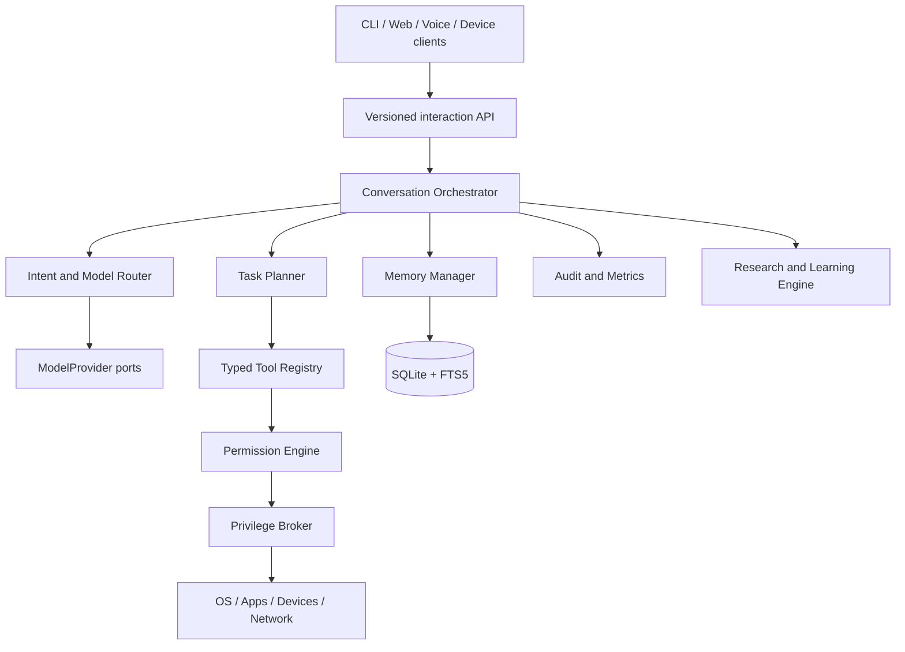
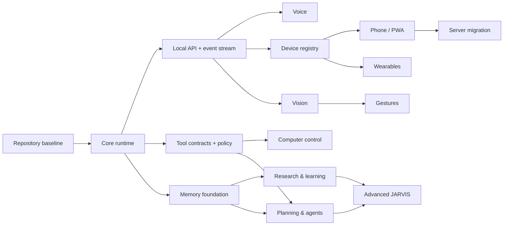

# JARVIS Master Roadmap

Status: decision-ready plan  
Planning date: 2026-08-19  
Repository: `DanCreates1/JARVIS`, branch `main`

## 1. Vision and engineering principles

JARVIS is a local-first personal AI operating layer: a composed conversational assistant that can use authorized tools, remember useful context, research with citations, and later work across voice, vision, laptop, phone, server, and wearable clients.

Success is the product of **intelligence × latency × reliability × privacy × hardware efficiency**. The system will therefore be:

- useful before it is broad;
- a modular monolith before any service split;
- local for privacy and routine work, with explicit cloud escalation for hard work;
- deterministic for actions that do not need a model;
- deny-by-default for tools and privileges;
- measurable, replaceable, and tested at every boundary.

Foundation-model training from zero is excluded. It would require a large curated dataset, multi-GPU training infrastructure, alignment and safety work, extensive evaluation, and ongoing serving capacity while offering no near-term advantage over current models. Fine-tuning is a later, evidence-driven option only after prompt, retrieval, memory, and tool-use evaluations expose a stable gap.

## 2. Discovered repository state

The repository no longer matches the legacy state assumed by the original planning request:

- `main` is clean at planning start and tracks `origin/main`.
- Current HEAD before this document is `2cd67b3` (`feat: create secure JARVIS core runtime`).
- The old implementation is preserved at `archive/pre-jarvis-rebuild-2026-08-18`.
- The new repository already contains a Python 3.11 modular core, Ollama adapter, SQLite transcript store, typed tools, policy boundary, tests, CI, `.gitignore`, and `.env.example`.
- No tracked model-weight, private-key, certificate, `.env`, or obvious secret file was found. Packed Git objects total about 2.05 MiB.

Therefore Phase 0 is mostly complete. Its future procedure is idempotent: verify the archive and current tree first; never delete the current secure core merely to repeat a reset. See `PHASE_0_REBUILD_PLAN.md`.

## 3. Target architecture

The initial deployable is one Python application with ports and adapters. Heavy inference and privileged execution may run in worker processes, but they remain parts of one product deployment until scale or isolation data justifies extraction.



Detailed components, flows, network boundaries, and data ownership are defined in `JARVIS_ARCHITECTURE.md`.

## 4. Priorities

| Priority | Capabilities |
| --- | --- |
| P0 — Essential | Text conversation, personality, provider abstraction, model routing, durable transcripts, typed tools, permission enforcement, audit logging, failure handling, tests |
| P1 — Important | Voice, useful laptop tools, long-term memory controls, web research with citations, planning state, secure phone/PWA access |
| P2 — Advanced | Vision, gestures, dedicated server, communications, multi-device coordination, richer agents, proactive assistance |
| P3 — Experimental | Meta glasses, custom voice, user fine-tuning, advanced smart-home orchestration, continuous multimodal context |

## 5. Preliminary model strategy

The laptop has 16 GB RAM and an RTX 2050 with 4 GB VRAM. A 3.4 GB quantized model nearly fills VRAM before context cache and concurrent speech workloads. Default to hybrid routing.

| Deployment option | Strengths | Weaknesses | Decision |
| --- | --- | --- | --- |
| Fully local | Maximum privacy, offline function, predictable marginal cost | Current laptop cannot provide top-tier complex reasoning at low latency; GPU contention with speech/vision | Supported mode for private/routine work, not overall default |
| Hybrid | Local privacy/latency for routine work plus explicit high-quality escalation | More routing, provider, privacy, and cost policy to test | **Recommended default** |
| Primarily cloud | Strong models and minimal local inference setup | Network/provider dependence, data exposure, recurring cost, less offline value | Supported configuration, not default |

```text
Tier 1: fast local classifier / command model
qwen3:1.7b Q4 through Ollama
        |
        | uncertainty, complex tool plan, long context
        v
Tier 2: main local JARVIS model
qwen3.5:4b Q4_K_M through Ollama, modest context budget
        |
        | difficult reasoning, high-stakes analysis, quality failure
        v
Tier 3: explicit cloud reasoning provider
balanced default such as GPT-5.6 Terra; flagship such as GPT-5.6 Sol only when justified
```

Model names are initial benchmark candidates, not permanent dependencies. The provider registry owns logical roles (`fast`, `main`, `heavy`) and maps them to configured provider/model IDs.

Routing signals:

- deterministic commands bypass an LLM after validated intent where confidence is sufficient;
- Tier 1 handles classification, short conversation, routing, and low-risk structured requests;
- Tier 2 handles normal conversation, tool selection, planning, coding, and analysis;
- Tier 3 requires user cloud permission and handles hard reasoning, broad research synthesis, or failed local verification;
- high-risk actions never gain permission because a stronger model was selected;
- private content marked local-only cannot route to cloud.

Later benchmark each candidate on representative JARVIS tasks for time to first token, tokens/second, RAM, VRAM, tool-call accuracy, reasoning quality, context behavior, power, temperature, and failure rate. Test at realistic 4K, 8K, and only then larger contexts; advertised maximum context is not a practical laptop target.

## 6. Performance targets

Targets are measured end-to-end at p50 and p95; they are not promises.

| Experience | Initial target |
| --- | --- |
| Wake-word decision after phrase | p50 ≤ 100 ms, p95 ≤ 200 ms |
| VAD end-of-speech decision | p50 ≤ 250 ms, p95 ≤ 450 ms |
| Short local transcription after speech ends | p50 ≤ 500 ms, p95 ≤ 1.2 s |
| Deterministic simple command, text result | p50 ≤ 300 ms, p95 ≤ 800 ms |
| First spoken response, deterministic command | p50 ≤ 800 ms, p95 ≤ 1.5 s |
| First spoken response, normal local LLM turn | p50 ≤ 1.5 s, p95 ≤ 3 s |
| Complex cloud reasoning first useful output | p50 ≤ 3 s, p95 ≤ 7 s |
| Gesture frame-to-action decision | p50 ≤ 75 ms, p95 ≤ 150 ms |
| Tool success rate for supported happy paths | ≥ 99% before unattended safe actions |

The voice pipeline must stream partial events and begin TTS by sentence or safe phrase. Keep wake word and VAD resident on CPU. On this 4 GB GPU, benchmark CPU STT versus GPU model swapping; avoid simultaneous residency assumptions.

## 7. Dependency graph and parallel work



After core contracts stabilize, these tracks can proceed in parallel:

- voice adapters and latency harness;
- permission UI plus a first safe computer-tool set;
- memory schemas, retention, and retrieval evaluation;
- local API/control panel shell;
- security test fixtures and observability instrumentation.

Phone access waits for authenticated API and device enrollment. Research waits for source-aware memory. Long-running agents wait for durable task state, tool policy, approval gates, and bounded execution.

## 8. Staged roadmap

Relative size covers implementation and verification, not calendar time.

### Phase 0 — Repository baseline and reset verification (Small; mostly complete)

**Goal**  
Establish a reproducible, secret-free source-of-truth repository while preserving legacy history.

**Deliverables**

- Verified `origin`, `main`, archive branch, and clean intended diff.
- Legacy archive pushed before any cleanup.
- `.gitignore`, `.env.example`, locked dependencies, baseline docs, CI, secret scan.
- New `src/` modular project only if reset has not already happened.

**Dependencies**  
Repository-owner access and authenticated Git push.

**Verification**  
Fresh clone passes setup and quality checks; archive ref resolves remotely; no secret, runtime database, model weight, or large generated file is tracked.

**Risks**  
Deleting rebuilt code, losing legacy history, committing credentials, rewriting published history.

**Exit criteria**  
The checks in `PHASE_0_REBUILD_PLAN.md` pass. For current repository, existing core remains intact and completed reset steps are recorded as verified/skipped.

### Phase 1 — JARVIS core and first text vertical slice (Medium; foundation exists)

**Goal**  
A useful text JARVIS with swappable models, personality, persistence, safe tools, and measurable behavior.

**Deliverables**

- `ModelProvider` capabilities and logical-role router with local and optional cloud adapters.
- Bounded conversation orchestration and streaming event contract.
- JARVIS system prompt/personality policy with regression examples.
- SQLite conversations plus first explicit memory records and deletion APIs.
- Typed tool registry, risk metadata, read-only tools, audit records.
- CLI and minimal browser chat or local control page.
- Structured errors, retries, fallback policy, latency metrics, cost budget.

**Dependencies**  
Phase 0 and current core contracts.

**Verification**  
Local offline chat works, restarts preserve authorized state, providers swap under contract tests, unsupported tools are denied, cloud use is visibly opt-in, and quality gate passes without live model access.

**Risks**  
4 GB VRAM limits, poor small-model tool use, personality drift, cloud privacy leakage.

**Exit criteria**  
Ten representative conversation/tool scenarios pass; p95 latency is recorded; a new machine can reproduce setup; no side-effecting action can bypass policy.

### Phase 2 — Voice (Large)

**Goal**  
Natural push-to-talk first, then wake-word conversation with streaming speech and barge-in.

**Deliverables**

- `AudioInput`, `VADProvider`, `WakeWordProvider`, `STTProvider`, and `TTSProvider` ports.
- Push-to-talk vertical slice using faster-whisper, Silero VAD, and Piper candidates.
- Partial transcript and sentence/phrase streaming to TTS.
- Wake word after false-positive testing; visible always-listening state and kill switch.
- Duplex session controller: cancel output, echo suppression/AEC strategy, barge-in.
- Device selection, audio health diagnostics, text fallback, latency harness.

**Dependencies**  
Phase 1 event stream and cancellation semantics.

**Verification**  
Scripted quiet/noisy audio suite reports WER and latency; interruption stops speech promptly; offline fallback works; selected microphone/speaker survives restart.

**Risks**  
GPU contention, false wakes, echo triggering, noisy-room accuracy, TTS licensing/voice quality.

**Exit criteria**  
Voice targets are met or exceptions documented; 30-minute soak has no deadlock or runaway capture; physical mute/kill path is verified.

### Phase 3 — Controlled computer access (Large)

**Goal**  
Authorized laptop actions through narrow deterministic tools, never unrestricted model-to-shell access.

**Deliverables**

- Permission levels 0–4, approval broker, expiring action grants, audit viewer.
- Read/search files, app launch, media/volume, clipboard, browser, system status.
- Bounded write/move/rename tools with preview, allowlisted roots, idempotency, and rollback where feasible.
- `PrinterTool` for discovery, status, validated document/page/copy selection.
- API-first automation; UI automation only through isolated adapters when no stable API exists.

**Dependencies**  
Phase 1 typed tools; local approval interface; security model tests.

**Verification**  
Path traversal, argument injection, stale approval, confused-deputy, and cancellation tests fail closed. Supported actions verify postconditions and emit audit records.

**Risks**  
Hallucinated actions, privilege escalation, Windows UI brittleness, irreversible file operations.

**Exit criteria**  
Every shipped tool has a threat classification, schema, timeout, result cap, tests, approval rule, and recovery behavior. No arbitrary shell tool exists.

### Phase 4 — Durable memory and personalization (Large)

**Goal**  
Useful recall without dumping history into prompts or silently treating guesses as facts.

**Deliverables**

- Working, episodic, profile, semantic, and task-memory schemas.
- Extraction candidates separated from committed memories; provenance and confidence.
- Hybrid retrieval using SQLite FTS5 plus measured embeddings when justified.
- Summarization, relevance/recency scoring, conflict handling, correction, export, retention, deletion.
- Memory viewer showing why a record was retrieved and where it came from.

**Dependencies**  
Phase 1 persistence, host identity, audit and privacy controls.

**Verification**  
Golden retrieval set measures recall/precision; deletion removes derived indexes; profile data is isolated by host; poisoned and contradictory memories are surfaced, not merged silently.

**Risks**  
Memory pollution, privacy over-retention, irrelevant retrieval, stale preferences.

**Exit criteria**  
Host can inspect, correct, export, and delete every durable memory; retrieval improves benchmark answers without unacceptable false recall.

### Phase 5 — Research and self-education (Large)

**Goal**  
Study host-selected subjects, build a cited library, and answer later from traceable knowledge.

**Deliverables**

- Research objective, plan, source acquisition, extraction, synthesis, and review pipeline.
- Source ledger storing URL, publisher, publication/retrieval dates, content hash, topic, license/usage notes.
- Fact/claim records labeled verified, likely, hypothesis, opinion, stale, or conflicting.
- Search and browser adapters with rate, domain, download, and content limits.
- Unanswered-question queue, update/revalidation jobs, cited notes and answers.

**Dependencies**  
Phase 4 source-aware memory; browser sandbox; prompt-injection defenses.

**Verification**  
Benchmark research tasks require citation coverage, source diversity, claim-to-source entailment, conflict reporting, and reproducible retrieval.

**Risks**  
Misinformation, stale sources, copyright misuse, hostile webpages, excessive API cost.

**Exit criteria**  
A topic can be researched, stored, inspected, updated, deleted, and later answered with source-level citations and uncertainty labels.

### Phase 6 — Planning and bounded agents (Very Large)

**Goal**  
Execute multi-step tasks with durable state, approval gates, verification, retries, and cancellation.

**Deliverables**

- Persisted task graph with dependencies, status, owner, budget, attempts, and checkpoints.
- Planner/executor/verifier roles implemented as bounded orchestration, not an agent swarm.
- Idempotency keys, retry classes, rollback/compensation hooks, pause/resume/cancel.
- Specialized research and computer agents only where separate context and permissions improve safety.
- Human-readable plan preview and approval at sensitive boundaries.

**Dependencies**  
Phases 3–5; reliable tool postcondition checks.

**Verification**  
Deterministic scenario suite covers partial failures, restarts, duplicate events, denial, timeout, budget exhaustion, and user cancellation.

**Risks**  
Autonomous loops, compounding model errors, stale plans, runaway tokens/cost, duplicate side effects.

**Exit criteria**  
Supported multi-step tasks resume safely after restart, never exceed configured budgets, and produce an understandable event/audit history.

### Phase 7 — Vision and gestures (Large)

**Goal**  
Low-latency perception and configurable gestures, escalating to multimodal models only when needed.

**Deliverables**

- Camera/screenshot capability adapters with visible capture state and retention policy.
- MediaPipe Hand Landmarker candidate plus OpenCV capture/preprocessing.
- Temporal gesture classifier, confidence/debounce, user calibration, configurable mappings.
- OCR/object/scene fast paths and separate expensive vision-model path.
- Mapping store such as `gesture -> intent`, never direct unreviewed privileged action.

**Dependencies**  
Phase 3 permissions; device/media privacy controls.

**Verification**  
Recorded and live datasets measure accuracy, false activations, lighting robustness, latency, and CPU use. Camera-off state is technically enforced.

**Risks**  
False gestures, privacy capture, lighting/occlusion, continuous CPU/GPU load.

**Exit criteria**  
Configured gestures hit accuracy/latency targets and cannot invoke actions above their mapped permission grant.

### Phase 8 — Secure phone/PWA access (Large)

**Goal**  
Use JARVIS away from laptop without a public unauthenticated API.

**Deliverables**

- Responsive PWA with text, voice, notifications, task and device status.
- Device enrollment with per-device keys, revocation, scoped capabilities, session expiry.
- Tailscale/private-network default plus application authentication and TLS.
- WebSocket/SSE reconnect, offline-safe UI, remote kill switch, rate limits.

**Dependencies**  
Stable versioned API, device registry, host authentication, server-side permission broker.

**Verification**  
Unauthorized, revoked, replayed, rate-limit, lost-phone, network-partition, and reconnect tests. External scan finds no unintended public listener.

**Risks**  
Lost phone, credential theft, overbroad tailnet rules, notification leakage.

**Exit criteria**  
An enrolled phone can use allowed features remotely; revocation immediately blocks it; sensitive actions still require appropriate approval.

### Phase 9 — Dedicated server migration (Large)

**Goal**  
Move intelligence and durable state to a server while laptop becomes a capability node.

**Deliverables**

- Deployment profiles for laptop-only and server-core/device-node modes.
- Encrypted backup/restore, data migration, model placement, health and failover runbooks.
- Mutual device authentication and capability advertisement.
- PostgreSQL migration only if concurrency/scale measurements justify it.

**Dependencies**  
Phase 8 device/network model and stable internal ports.

**Verification**  
Same acceptance suite passes in both topologies; migration and rollback are rehearsed from backups; network loss degrades safely.

**Risks**  
State split-brain, network dependence, weak device identity, expensive underused hardware.

**Exit criteria**  
Core location changes through configuration/deployment, not business-logic rewrite; laptop retains defined offline capabilities.

### Phase 10 — Wearables and Meta glasses (Large, P3)

**Goal**  
Add supported glasses as one generic device client, without making JARVIS Meta-dependent.

**Deliverables**

- `WearableClient` capability contract for microphone, audio, camera, notification, and controls.
- Meta Wearables Device Access Toolkit feasibility spike against current program/API availability.
- Consent, capture indication, bandwidth, battery, disconnection, and privacy behavior.
- Phone-bridge fallback when direct device integration is unavailable.

**Dependencies**  
Phases 7–9 and vendor developer access.

**Verification**  
Capability matrix is confirmed on real hardware; unsupported features fail explicitly; revocation and camera/mic indicators are tested.

**Risks**  
API limitations, program access changes, battery, latency, vendor policy, bystander privacy.

**Exit criteria**  
At least one wearable interaction works through generic interfaces; removal of the Meta adapter does not affect core behavior.

### Phase 11 — Advanced JARVIS (Very Large, P2/P3)

**Goal**  
Add proactive, scheduled, multi-device, and deeper multimodal help after safety and reliability are proven.

**Deliverables**

- Proactivity policy with quiet hours, relevance threshold, budget, and opt-out.
- Scheduled agents, multi-device handoff, smart-home adapters, richer multimodal context.
- Evaluation-gated custom voice or user-specific fine-tuning only if justified.

**Dependencies**  
Mature task engine, device registry, memory quality, observability, and security operations.

**Verification**  
Long-duration evaluation tracks interruption cost, false proactivity, budget, privacy, and action correctness. Every proactive channel has a kill switch.

**Risks**  
Annoyance, surveillance feel, autonomy creep, cost, accumulated memory error.

**Exit criteria**  
Proactive features meet explicit host acceptance thresholds and can be disabled without degrading core on-demand JARVIS.

## 9. JARVIS MVP, V1, and long-term definition

### JARVIS MVP — earliest useful release (Medium)

Qualifies only when all are true:

- text conversation with tested JARVIS personality;
- fast and main local roles plus optional stronger provider;
- persistent transcripts and inspectable basic profile/task memory;
- several useful read-only laptop tools and at least one approval-gated reversible tool;
- secure typed execution, audit records, basic cited web research;
- local CLI or web chat, failure messages, and measured latency;
- reproducible setup and passing CI/security checks.

The current core is a strong foundation but does not yet meet the full MVP: cloud/provider routing, richer memory, browser research, and useful controlled laptop tools remain.

### JARVIS V1 — dependable daily assistant (Very Large cumulative)

MVP plus voice with barge-in, controlled computer tools including printing, inspectable long-term memory, research/learning engine, bounded multi-step tasks, local control panel, and secure phone PWA. Vision/gestures may ship separately if not reliable enough.

### Long-term JARVIS

A server-capable, local-first, multimodal personal operating layer with secure device clients, calibrated memory and research, bounded agents, natural voice, optional vision/gestures/wearables, and proactive help controlled entirely by host policy.

## 10. What not to overengineer in V1

- No Kubernetes, service mesh, distributed event bus, or premature microservices.
- No multiple primary databases; SQLite first, PostgreSQL only on measured need.
- No custom foundation-model training or continuous weight updates.
- No agent swarm; one orchestrator and a few justified specialized roles.
- No unrestricted shell, always-admin daemon, or public unauthenticated endpoint.
- No native mobile app until PWA limits are demonstrated.
- No Redis until cross-process coordination or caching has a measured requirement.
- No permanent storage of raw audio/video by default.
- No enormous context windows used as a substitute for retrieval.

## 11. Future server tiers

These are capability envelopes, not shopping recommendations.

| Tier | CPU | RAM | GPU/VRAM | Storage | Intended use |
| --- | --- | --- | --- | --- | --- |
| Budget | Modern 8–12 cores | 64 GB | 16 GB VRAM | 2 TB NVMe | Strong 7B–14B quantized models, voice, light vision, one active user |
| Recommended | Modern 12–20 cores | 128 GB, ECC preferred | 24 GB VRAM | 2–4 TB NVMe plus encrypted backup | Responsive 14B–32B quantized models, concurrent voice/vision, development headroom |
| High end | 24+ cores | 192–256+ GB ECC | 48+ GB VRAM, single GPU preferred initially | 4+ TB high-endurance NVMe plus separate backup | Larger local reasoning/multimodal models, longer contexts, multiple concurrent workers |

All tiers need reliable 2.5 GbE or better where useful, UPS-backed power, monitored thermals, encrypted backups, and GPU support verified against the chosen inference runtime. Prefer one adequately sized GPU over complex multi-GPU topology until benchmarks justify it.

## 12. Risk register

| Risk | Likelihood | Impact | Mitigation |
| --- | --- | --- | --- |
| Local model too slow or weak | High | High | Hybrid routing, small-context budgets, benchmark representative tasks, retain provider swap |
| 4 GB VRAM contention with STT/vision | High | High | CPU-resident VAD/TTS, benchmark CPU STT/model swapping, explicit residency scheduler |
| Wake-word false activation | Medium | High | Push-to-talk first, threshold evaluation, cooldown, visible listening state, kill switch |
| Hallucinated tool action | High | Critical | Deterministic schemas, independent policy, plan preview, approval token, postcondition check |
| Prompt injection from web/files | High | Critical | Treat content as data, isolate parser/browser, least-privilege tools, provenance, taint labels |
| Privilege escalation | Medium | Critical | Separate broker, no always-admin core, scoped grants, OS controls, security tests |
| Remote-access vulnerability | Medium | Critical | Private network, TLS, application auth, device keys, revocation, rate limits, audit |
| Memory pollution/stale facts | High | High | Candidate/committed separation, provenance, confidence, conflict, correction, expiry |
| Research misinformation | High | High | Source quality scoring, claim citations, conflict reporting, freshness checks |
| Autonomous/runaway loops | Medium | Critical | Bounded steps/time/tokens/cost, persisted state, cancellation, approval gates |
| Runaway API costs | Medium | High | Per-task/user budgets, cached retrieval, model ladder, usage metrics, hard caps |
| Provider/API churn | Medium | Medium | Capability-based ports, contract suite, no provider types in core models |
| Meta wearable limitations | High | Medium | P3 only, generic interface, phone bridge, feasibility gate |
| Data loss | Medium | High | Transactional migrations, encrypted backup, restore drills, no secrets in logs |

## 13. Final roadmap summary

### Recommended initial stack

Python 3.11, `uv`, asyncio, Pydantic, Typer, SQLite/FTS5, `httpx`, Ollama, FastAPI plus SSE when the local API is added, Pytest/Ruff/mypy/pip-audit/Gitleaks, structured JSON events, Windows-native adapters behind ports, Tailscale plus application authentication for remote access.

### Recommended initial model strategy

`qwen3:1.7b` fast candidate → `qwen3.5:4b` main candidate → explicit cloud `heavy` provider. Benchmark before changing the repository default. Keep context modest and use retrieval.

### First implementation milestone after planning

**M1: close the text MVP gaps.** Add logical model roles/router, optional cloud-provider contract, streaming events, basic source-aware memory, two or three safe system/file tools, approval record structure, and basic cited web research. Preserve current core and tests.

### Exact build order

1. Verify Phase 0/current baseline; do not repeat destructive reset.
2. Stabilize model, event, tool-risk, approval, audit, host, and memory contracts.
3. Complete text MVP and benchmark fast/main/cloud routing.
4. Add loopback local API and minimal control panel.
5. Build push-to-talk voice; then wake word and barge-in.
6. Add permission broker and controlled laptop/printing tools.
7. Add durable memory controls and retrieval evaluation.
8. Add research/learning engine.
9. Add persisted planning and bounded specialized agents.
10. Add vision/gesture track.
11. Add device registry and secure phone PWA.
12. Migrate to server when hardware exists.
13. Evaluate wearables and advanced proactive features.

### Parallelizable work

After contracts in step 2: voice harness, control panel, security fixtures, memory evaluation set, and read-only tool adapters. After authenticated API/device registry: PWA and server deployment work. Vision can run beside research/planning after media privacy rules exist.

### Biggest technical risks

Laptop GPU limits, small-model tool reliability, low-latency duplex audio, prompt injection, permission correctness, memory quality, secure remote access, and bounded autonomy.

### Features intentionally deferred

Native mobile app, Meta glasses, smart home, custom voice, fine-tuning, proactive agents, large local models, PostgreSQL, Redis, microservices, and multi-GPU serving.

### JARVIS MVP definition

Text JARVIS with personality, local fast/main roles, optional heavy provider, persistent inspectable memory, useful safe laptop tools, permission/audit controls, cited basic research, reproducible setup, and measured latency.

### JARVIS V1 definition

MVP plus natural voice/barge-in, controlled computer and printer actions, durable memory controls, research/learning, bounded multi-step tasks, control panel, and secure phone PWA.

### Long-term JARVIS definition

A host-controlled, server-capable, multimodal personal operating layer spanning authorized devices, with calibrated memory/research, bounded agents, optional vision/gestures/wearables, and safe opt-in proactive assistance.
