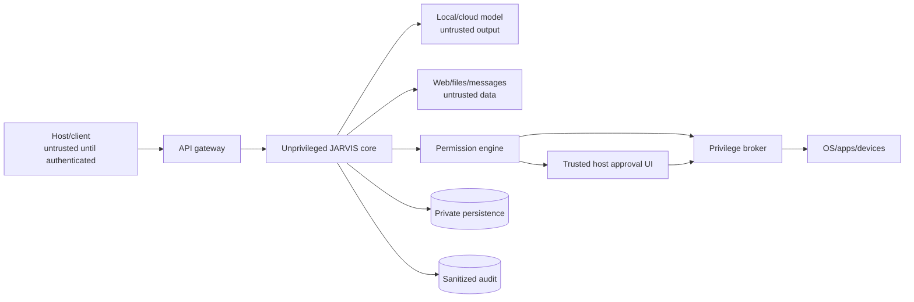
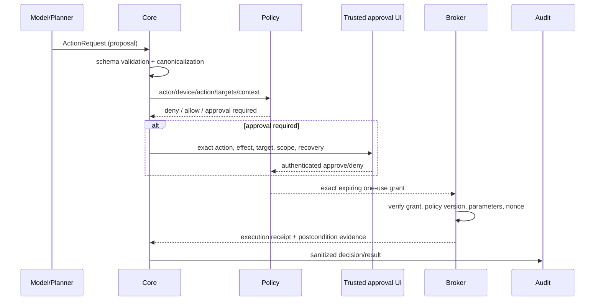

# JARVIS Security Model

Status: required controls and security architecture  
Planning date: 2026-08-20
Last reconciled with Phase 1-8A implementation: 2026-09-10

Current implementation retains these fail-closed controls. The clean-Windows bootstrap and exact
repository CI gate now pass independently; remaining Phase 1–3 blockers are latency/provider
capacity and separately authorized live-device/effect checks. No device-control, approval,
privacy, performance, or live-hardware gate is weakened by this document.

## 1. Security objective

JARVIS may process private conversations and eventually control files, applications, communications, printers, cameras, and other devices. Security must prevent a model, untrusted content, compromised client, or coding defect from acquiring authority the host did not grant.

Core invariant:

> Model output may propose an action. Only authenticated identity, deterministic policy, exact approval, and a least-privilege broker may authorize and execute it.

JARVIS does not bypass passwords, device locks, authentication controls, platform security, or third-party terms.

## 2. Threat model

Protected assets:

- host identity, preferences, conversations, memories, tasks, and research;
- credentials, tokens, device keys, provider keys, cookies, and certificates;
- files, applications, communications, printers, cameras, microphones, and devices;
- audit integrity, model/provider configuration, and permission policy;
- availability and resource/API budgets.

Threat sources:

- malicious or ambiguous user/client input;
- prompt injection in webpages, documents, email, images, OCR, and tool results;
- hallucinated, malformed, or adversarial model output;
- compromised/lost phone or enrolled device;
- malicious dependency, model file, extension, or update;
- remote attacker against API/network surface;
- local process/user with insufficient authorization;
- accidental host approval, configuration mistake, or overbroad tool;
- autonomous loop or denial of wallet/resources.
- privacy misclassification that sends sensitive context to a cloud provider;
- free-tier exhaustion, preview-model retirement, or fallback that silently enters paid service.

Out of scope as a guarantee: defending a fully compromised OS administrator/kernel. JARVIS still minimizes stored secrets, exposes kill switches, and keeps recoverable audit/backup evidence.

## 3. Trust boundaries



The core, model, content processors, policy engine, approval UI, and broker are distinct logical trust zones even while some initially share a process. Privileged execution becomes a separate process/service before administrative tools ship.

Every cloud provider is a separate external disclosure boundary. A deterministic local gate assigns sensitivity before any cloud router or model sees the request. Uncertain content is sensitive by default. No provider fallback may weaken this label.

Initial cloud policy:

- non-sensitive requests may use configured Groq or Gemini free-tier roles;
- sensitive, personal, credential, file, memory, communication, and device context remains local;
- unavailable local inference causes a private failure, never automatic cloud disclosure;
- cloud credentials belong to billing-disabled/free-tier projects and maximum cloud cost is exactly `$0`;
- provider `429`, outage, model removal, or catalog mismatch triggers a bounded free/local fallback or clear capacity error;
- Groq Zero Data Retention should be enabled, but cloud transport remains disclosure;
- unpaid Gemini must not receive confidential or personal information because Google may use unpaid-service inputs/outputs for product improvement and human review.

## 4. Host identity and authentication

`Host` is the primary authorized human. A host profile contains stable ID, display preferences, enrolled authentication methods, owned devices, permission policy, memory scope, communication preferences, and emergency/kill-switch settings.

Authentication rules:

- Local interactive setup binds the first host using the current OS user plus explicit enrollment.
- Remote clients use modern passkey/OIDC or equivalent phishing-resistant authentication where feasible, plus an enrolled device credential.
- Sessions are short-lived, revocable, audience-bound, and carry host/device identity and assurance level.
- Sensitive and administrative actions require recent step-up authentication on a trusted approval surface.
- Voice recognition may personalize or identify a likely speaker; it is never sufficient alone for Levels 3–4.
- Wake word is activation, not authentication.
- Recovery codes/keys are generated and stored outside the repository; recovery events revoke old sessions.

Phase 1 single-host operation still includes `host_id` in durable schemas so multi-user assumptions do not leak into data later.

## 5. Device identity and enrollment

Every remote/device node has a unique asymmetric credential, not a shared API key. Enrollment requires authenticated host approval and displays device name/type, requested capabilities, credential fingerprint, and maximum risk level.

Device record:

- stable device ID, host ID, type, public key/reference;
- approved capabilities and permission ceiling;
- enrollment/expiry/last-seen timestamps;
- software/protocol version and optional posture evidence;
- active, quarantined, expired, or revoked state.

Requirements:

- private keys remain in OS secure storage where available;
- rotate credentials and support immediate revocation;
- reject replayed nonces/timestamps and wrong audience;
- a device cannot self-add capabilities after enrollment;
- lost-phone flow revokes device and sessions, then confirms audit history;
- disconnected devices are marked unavailable; actions are not silently rerouted.

## 6. Authorization and permission levels

Risk is based on effect, target, scope, reversibility, sensitivity, destination, and required privilege—not the model’s confidence.

| Level | Meaning | Examples | Default handling |
| --- | --- | --- | --- |
| 0 | Read-only, low sensitivity | Time, public system health, list allowed printers | May auto-run for authenticated host within capability |
| 1 | Safe and reversible | Pause media, create draft, open known app | Auto-run only when explicitly enabled; audit |
| 2 | Normal side effect | Create file in allowed workspace, move small set with rollback, print ordinary document | Intent preview or policy-based approval; audit and verify |
| 3 | Sensitive/high impact | Send communication, bulk delete, expose private file, install software | Exact explicit approval plus recent authentication |
| 4 | Administrative/critical | Change security setting/service, admin command, financial action | Disabled by default; step-up approval and dedicated narrow broker action |

Phase 3 implements all five semantics but exposes handlers only at Levels 0–2. Its shipped engine
requires exact trusted-terminal approval for every Level 1 and Level 2 effect. Level 3 is rejected
by the host policy schema; Level 4 is always denied.

Risk escalation examples:

- one reversible file move may be Level 2; recursive/bulk move is Level 3;
- drafting email is Level 1; sending is Level 3;
- reading public calendar availability may be Level 0/1; exporting private details externally is Level 3;
- listing printers is Level 0; printing a normal document is Level 2; printing sensitive content remotely may be Level 3;
- any financial commitment remains Level 4 and should initially be unsupported.

Unknown or ambiguous classification fails closed.

## 7. Action authorization pipeline



An approval binds:

- actor and approving host;
- device and tool/version;
- canonical exact parameters and target set;
- risk level and policy version;
- expiry, one-use nonce/idempotency key;
- optionally maximum cost/count/bytes and allowed substitutions;
- displayed human-readable effect and rollback limits.

Changing any bound value requires a new decision/approval. “Yes” to a vague conversational plan is not approval for undisclosed side effects.

## 8. Privilege broker

The main JARVIS process runs as the normal user. Phase 3 uses a minimal in-process local broker with
fixed handlers; the model-facing adapters are inert, trusted approval runs as a separate local CLI
command, and durable one-use authority crosses normal process restarts. The broker accepts no
natural language, model messages, shell strings, arbitrary executable paths, dynamic actions, or
elevation. It revalidates the authenticated actor/session/interface/capabilities and complete live
policy fingerprint before dispatch.

This is not a Windows privilege boundary or administrator service. A separately authenticated
process/service remains mandatory before any Level 4 operation ships.

Broker requirements before Level 4 ships:

- separate process/service identity with only required OS rights;
- allowlisted action IDs mapped to fixed code paths;
- structured binary/JSON protocol over authenticated local IPC;
- exact grant verification, replay prevention, timeout, cancellation policy;
- canonical path and executable validation after link/junction resolution;
- fixed argument arrays; never `shell=True`, `Invoke-Expression`, or command concatenation;
- bounded input/output and sanitized receipt;
- OS audit integration where practical;
- signed/reproducible release and strict update channel.

The broker cannot grant itself new actions or edit policy. Administrative support is per operation, never an unrestricted always-root/admin JARVIS.

## 9. Tool safety

Every tool must have:

- owner, stable name/version, purpose;
- typed input/result schemas and semantic validation;
- side-effect and sensitivity classification;
- required capabilities and permission level;
- timeout, memory/output/count/size limits;
- concurrency, idempotency, retry, and cancellation semantics;
- postcondition verifier;
- rollback/compensation or clear irreversibility warning;
- unit, policy, integration, failure, and injection tests.

Specific controls:

- Files: canonical allowlisted roots; reject junction/symlink escape; preview bulk sets; no workspace-root recursive delete; recoverable recycle/trash where possible.
- Processes: fixed executables and argument arrays; no arbitrary shell; constrained environment; no inherited secrets.
- Browser: isolated profile/session; URL and redirect validation; downloaded content quarantined; page text has no authority.
- Clipboard: explicit read/write capability; prevent secret logging; clear only with approval.
- Printer: validate local source type, pages, copies, printer ID; preview sensitive/remote jobs; audit job result without retaining document.
- Communications: draft and send are separate tools; display recipients/content/attachments before send.
- UI automation: isolated adapter, visible activity, screenshot/target verification, low privilege; use only without a stable API.

## 10. Destructive-action protection

Before destructive or difficult-to-recover action:

1. enumerate exact targets read-only;
2. canonicalize and re-check scope;
3. show count, size, destination/effect, reversibility, and exclusions;
4. require Level 3/4 approval as applicable;
5. create backup/rollback metadata when feasible;
6. execute bounded batches;
7. verify postconditions;
8. stop on unexpected expansion or partial failure;
9. report recovery state and audit reference.

Never infer permission to broaden targets, disable security, bypass a password, overwrite unknown user changes, or continue after target set changes.

## 11. Prompt-injection defense

External content is data. This includes webpages, search snippets, documents, PDFs, emails, messages, OCR, images, memory records, model/provider output, and tool results.

Controls:

- system/developer policy and tool permission data are never concatenated from content;
- label provenance/trust and delimit content in model context;
- content cannot register tools, change risk, grant approval, request secrets, or alter system configuration;
- use least-privilege task-specific tool sets; research gets read/network tools, not computer-write tools;
- separate acquisition/parsing from action execution;
- sanitize active content and do not execute downloaded scripts/macros;
- cap fetch size, type, redirects, depth, domains, time, and downloads;
- require citations to original sources and detect unsupported claim/source pairs;
- high-risk action proposed after reading untrusted content always needs host-visible reasoning/effect and approval;
- test direct, indirect, multilingual, encoded, image/OCR, and memory-poisoning injection cases.

No prompt-only defense is considered sufficient. Deterministic policy and broker boundaries enforce authority.

Phase 5 acquisition additionally resolves every initial/redirect hostname, rejects direct IP,
localhost, private/link-local/shared/reserved/multicast/unspecified addresses, pins the connection
to the validated public IP, and keeps original Host/SNI certificate verification. Redirects are
manual, bounded, and same-domain unless explicitly allowlisted. Proxy environment settings,
credentials, cookies across hops, active HTML elements, unsupported types, oversized/empty bodies,
and missing/invalid response metadata fail closed. HTML/plain/PDF parsing runs in a short-lived
isolated Python worker with a minimal environment, temporary working directory, fixed time/input/
output/page/filter limits, and no network or action tools. The worker is defense in depth, not an OS
AppContainer. Cancellation is never converted into retry.

### Phase 6 bounded-task boundary

- Plan JSON and model-generated structure are untrusted proposals, never authority. Host validator
  resolves handler kind, retry mode, charges, timeout ceilings, and approval requirements from an
  immutable registry.
- Unknown handlers/dependencies, cycles, budget expansion, unsafe effect retry, planner-supplied
  authority fields, and excessive deadlines fail before persistence or execution.
- Execution defaults off and starts only through explicit foreground CLI use. No daemon,
  self-scheduling loop, recursive delegation, or dynamic handler loading ships.
- Steps, wall time, tokens, provider requests, retries, tool calls, cost, and concurrency are hard
  ceilings reserved before dispatch. Cost remains `$0`; parallelism is at most four independent
  read-only nodes; effects serialize.
- Effect nodes require idempotency plus an exact existing Phase 3 one-use grant. Task planning and
  loopback API cannot create approvals. Grant reuse and argument/action substitution fail closed.
- Durable content-minimized checkpoints bracket effects. Restarted read-only work may retry only
  within remaining policy and budget; uncertain effects enter `needs_reconciliation` and are never
  replayed without durable postcondition evidence.
- Host-scoped records use optimistic versions and ordered append-only lifecycle events. Events and
  checkpoints exclude node arguments, research text, action payloads, and raw handler output.
- Exclusive export and exact transitive deletion ship. Deletion leaves only a content-free
  tombstone; external backup copies remain separately governed artifacts.

See [Bounded Tasks](BOUNDED_TASKS.md) for operator and recovery commands.

## 12. Secrets and credentials

- Never commit `.env`, passwords, API tokens, cookies, private keys, certificates, provider credentials, or device secrets.
- `.env.example` contains names and safe local defaults only.
- Prefer Windows Credential Manager/DPAPI-backed storage or a reviewed secret manager; environment variables are acceptable process injection, not a durable vault.
- Redact authorization headers, query tokens, connection strings, and secret-like values from logs/errors.
- Diagnostics never dump the process environment or credential-store contents.
- Pass only required secrets to a child process; do not inherit the whole environment.
- Separate development and production credentials; use narrow scopes and expiry.
- Secret rotation/revocation is documented and tested.
- If a secret enters Git, revoke it immediately and clean history through an explicit incident process; `.gitignore` alone does not remove exposure.

Model weights, GGUF, safetensors, Ollama blobs, voice models, runtime databases, raw audio/video, screenshots, and private user data remain outside Git.

## 13. Network and remote access

Local API requirements:

- bind loopback by default;
- non-loopback startup refused unless authentication and reviewed TLS/private gateway configuration exist;
- restrictive CORS; request/schema/body limits; timeouts and rate limits;
- versioned routes; no direct Ollama or broker exposure;
- health endpoints reveal minimal information.

Remote default:

- Tailscale/private network with deny-by-default grants;
- TLS at the JARVIS service/gateway even on private network where practical;
- application authentication, per-device authorization, replay protection, revocation;
- no unauthenticated public Internet API;
- remote kill switch and local-only recovery path;
- inbound/outbound firewall rules limited to explicit service needs.

Tailscale membership does not equal JARVIS approval. A tailnet device still needs application enrollment and scoped capability. Use scoped OAuth/trust credentials for any Tailscale automation rather than long-lived broad API tokens.

Phase 8A implements the application identity boundary while retaining loopback-only networking:

- enrollment starts only from a trusted local CLI and fixes exact device type, scope, risk ceiling,
  five-minute expiry, and one-use challenge;
- the client proves possession of a unique Ed25519 private key; the server persists only the public
  key/fingerprint and never sends credential material to a model;
- 15-minute opaque session tokens are returned once and persisted only as SHA-256 digests;
- every protected request also proves device-key possession over method, authority, raw path/query,
  body digest, time, nonce, audience, device ID, key version, and session-token digest;
- a 60-second skew window and atomic durable nonce consumption reject stale, concurrent, and
  post-restart replay;
- request authority is the intersection of device and session scopes; device audit is restricted to
  the authenticated device;
- key rotation requires current-key authentication and new-key proof, then revokes old sessions;
  trusted-local device revocation immediately revokes every session;
- lifecycle/denial audit omits tokens, challenges, signatures, public keys, request bodies, and
  private content; denial retention is bounded per identity.

Phase 8A does not authorize a non-loopback listener. TLS/private-network deployment, firewall
policy, rate limiting, trusted browser cookies/origin defenses, PWA behavior, and real-phone testing
remain explicit Phase 8B-8D work. See `docs/REMOTE_ACCESS.md`.

## 14. Memory, research, audio, and vision privacy

Data minimization:

- Phase 2 raw audio is bounded, buffered in memory, and discarded after the turn;
- Phase 2 VAD/STT/TTS run locally; wake/clap foundations are local but continuous listening is
  hard-disabled;
- explicit push-to-talk shows `MIC ON`; a separately persisted software kill state is polled during
  capture and output, while physical mute remains independent host control;
- camera/screen capture requires explicit active state and visible indicator;
- Phase 7A also requires two default-off gates, an exact foreground request, a bounded region,
  ephemeral-only retention, one active session, and immediate controller-owned buffer clearing;
- native camera/screen access runs in a short-lived worker with a fixed non-secret environment;
  timeout, cancellation, source loss, protocol error, or control uncertainty kills the worker;
- Phase 7B landmarks and motion windows remain local/ephemeral; only aggregate dimensionless
  calibration thresholds and content-free gesture observations may leave a frame consumer;
- Phase 7B model setup is explicit, bounded, revision-pinned, SHA-256 verified, and stored outside
  Git; OpenCV DNN inference makes no network call and retains no pixels or landmarks;
- one-hand, confidence, freshness, ordering, debounce, release, cooldown, and motion-consistency
  checks make uncertainty/conflict/replay a no-event result; gesture confidence grants no authority;
- Phase 7C revalidates the content-free observation, applies only an immutable fist/palm/pinch/roll
  mapping, and enters the existing actor/session/freshness/replay/rate-limited Phase 3 gate;
- every mapped action family is default-off and Level 1 only; the bridge cannot encode arguments,
  approve, issue grants, call the broker, or start capture/background work; fist cancel creates no
  authority;
- MediaPipe Tasks is not installed or initialized; the shipped OpenCV DNN path has no Tasks-runtime
  metrics/metadata disclosure;
- no raw camera/audio persistence without purpose, retention, and approval;
- memories are candidates until policy/host confirmation commits them;
- extraction, tool, import, and derived content is untrusted provenance; confidence never grants
  authority or bypasses confirmation;
- candidate promotion binds host scope, trusted interface, exact version, and content digest;
- only committed, unexpired, non-corrected records enter FTS or prompt projection;
- open contradictions and untrusted-source warnings are visible retrieval reasons, never silently
  merged facts;
- a deterministic local gate labels sensitivity before any cloud request;
- cloud routing receives only the minimum fields required and is blocked for sensitive or uncertain content;
- role/model overrides may strengthen privacy but cannot weaken sensitivity, cost, or provider-data policy;
- free-tier quota exhaustion never authorizes paid service or broader disclosure;
- source-backed research stores provenance and bounded extracted text, respecting licensing/terms.

Host controls:

- inspect why memory exists and why it was retrieved;
- correct, export, expire, and delete records;
- configure retention by data class;
- purge derived FTS/embedding/cache data transitively;
- disable cloud, audio retention, camera, remote access, individual devices/tools.
- inspect capture gates without opening a source and persistently disable new/current vision
  capture with `jarvis vision disable`.
- inspect the selected model role/provider, routing reason, privacy label, fallback, quota state, and estimated cost for each cloud-routed turn.

Phase 4 partitions every memory operation by a pseudonymous local user/device host ID. A request
cannot select another host scope, and not-found behavior avoids cross-host existence oracles.
Corrections supersede old facts while retaining lineage and append-only event evidence. Deletion
physically removes canonical content, FTS rows, provenance, conflicts, and sole-source derivations;
minimal tombstones retain no deleted content or content hash. Exports are explicit local files,
created exclusively without overwrite. The host ID remains an isolation key, not authentication.
Phase 8A maps each authenticated remote device back to that fixed host scope; later clients cannot
choose a different host ID.

Phase 5 applies the same local host partition to research sources, FTS results, citations, claims,
conflicts, mutations, exports, and deletion. Cross-host references fail as not found. Source text
remains explicitly untrusted in typed records and cannot enter trusted Phase 4 memory without a
separate future host-approved path. Research runs are volatile by default. Durable storage requires
an exact, expiring, one-use host approval bound to the displayed report digest; source/model content
cannot grant it. Source changes/unavailability stale dependent claims rather than silently
preserving verification. Transitive deletion physically removes all versions of a URL plus
dependent reports, claims, citations, conflicts, and index rows. Minimal tombstones and append-only
events retain identifiers, versions, reasons, and timestamps only—not source text, claim text,
quotes, or content hashes. JSON export is explicit, host-scoped, local, and refuses overwrite.

Backups are encrypted, access-controlled, and tested for restore. Deletion policy states whether and when backup copies expire.

## 15. Audit logging

Important action record:

```json
{
  "event_id": "...",
  "timestamp_utc": "...",
  "actor_id": "host:...",
  "device_id": "device:...",
  "request_id": "...",
  "intent": "print_document",
  "tool": "printer.print@1",
  "parameters": {"printer_id": "redacted-id", "pages": "1-2", "copies": 2},
  "permission_level": 2,
  "policy_decision": "approved",
  "approval_id": "...",
  "result": "succeeded",
  "error_code": null,
  "duration_ms": 843,
  "verification": "job accepted"
}
```

That object is a design envelope, not the Phase 3 operator projection. Phase 3 stores exact private
authority in the protected local database only for enforcement/restart, while `computer audit`
shows a separate bounded lifecycle projection without parameters, private content, actor/device
identifiers, fingerprints, or raw results. It includes proposal, decision/expiry, grant transitions,
broker rejection, execution, cancellation, postcondition outcome, and recovery status.

Audit requirements:

- append-only logical semantics and monotonic sequence/correlation IDs;
- UTC timestamps and sanitized structured fields;
- retention, rotation, export, and access policy;
- tamper evidence on server deployments where justified;
- log policy decisions and denials, not hidden chain-of-thought;
- never log secrets or unnecessary private content;
- audit failure causes sensitive actions to fail closed when accountability would otherwise be lost.

Implemented setup, retention boundary, kill path, recovery, and Windows limits are documented in
[Controlled Computer Access](CONTROLLED_COMPUTER_ACCESS.md).

## 16. Supply chain and model security

- Lock Python dependencies and review lock changes.
- Pin GitHub Actions by reviewed versions/digests where supported; use least permissions.
- Run Ruff, mypy, pytest, dependency audit, and secret scan in CI.
- Download models only through explicit commands from approved sources.
- Record logical name, artifact digest, quantization, license, source, and runtime compatibility.
- Do not load unreviewed Python pickles or execute model repository code.
- Verify native binaries/wheels and code-sign releases where practical.
- Maintain software/model inventory and update/rollback procedure.
- Treat provider/model behavior changes as release changes requiring regression tests.

## 17. Availability and cost controls

- Maximum tool rounds, plan steps, elapsed time, retries, context/output tokens, download bytes, and API spend per task.
- Concurrency limits for GPU and side-effecting tools.
- Circuit breakers and provider health states; honor retry-after.
- No blind retry after uncertain side effect; reconcile/verify first.
- Local core remains functional when Internet/cloud fails.
- Permission service failure denies actions; model/provider failure cannot disable policy.
- Disk-space thresholds protect database/audit integrity.
- Emergency stop cancels plans, disables remote sessions, and stops brokers/listening where possible.

## 18. Security testing and release gates

Required automated suites:

- unknown tool and invalid schema denied;
- path traversal, junction/symlink escape, command/argument injection;
- approval parameter mutation, replay, expiry, wrong actor/device, downgrade;
- prompt injection from web/file/email/OCR/memory/tool result;
- cross-host/device data isolation;
- authentication/session fixation/revocation/rate limiting;
- secret redaction and diagnostic leakage;
- partial side effects, restart reconciliation, duplicate messages;
- cloud privacy-routing enforcement;
- zero-spend enforcement, free-tier exhaustion, provider outage, and preview-model removal;
- transitive memory deletion and retention;
- wake-word/camera kill switch state.
- camera/screen default denial, exact-region/source enforcement, indicator-before-open ordering,
  stale/malformed-frame rejection, frame zeroing, and worker secret-environment stripping.

Release gate for a side-effecting tool:

1. threat/risk classification approved;
2. typed contract and bounded implementation reviewed;
3. permission and trusted-approval UX tested;
4. postcondition/recovery behavior tested;
5. audit record verified and redacted;
6. failure/injection tests pass;
7. documentation states effects and limitations.

Level 4 actions require a dedicated threat review and are disabled by default.

## 19. Incident response outline

1. Activate kill switch: disable remote access, high-risk tools, and affected provider/device.
2. Preserve sanitized audit evidence and relevant versions/digests.
3. Revoke/rotate exposed credentials and device sessions.
4. Contain affected broker/tool/model/dependency; do not erase evidence casually.
5. Assess affected actions/data/hosts and notify owner privately.
6. Restore from verified backup or known-good build.
7. Add regression test and document root cause/controls before re-enabling.

Never place credentials or private conversation evidence in a public issue.

## 20. Security definition of done

JARVIS is not “secure” because its prompt asks it to be careful. A release is acceptable only when:

- identity and device scope are explicit;
- tools are deny-by-default and schema-bound;
- risk decisions occur outside model output;
- sensitive actions use exact trusted approval;
- privileged work uses a narrow broker;
- external content has no authority;
- secrets/private data stay out of Git/logs;
- remote access is authenticated, encrypted, revocable, and not publicly open by default;
- important actions are verifiable and audited;
- failure, injection, and recovery tests pass.
